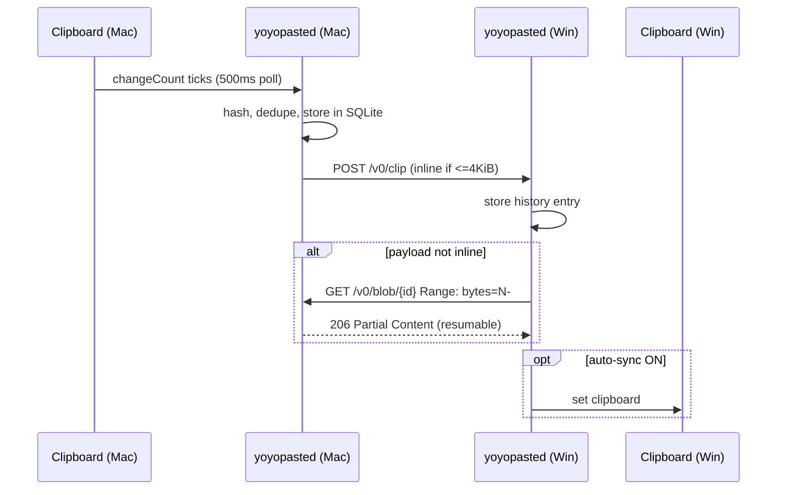
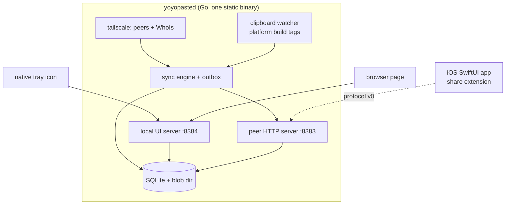

# YoYoPaste

> Copy on one device, paste on another — over your Tailscale tailnet.

[](https://github.com/Yeyo-N/YoYoPaste/actions/workflows/ci.yml)
[](LICENSE)
[](https://github.com/Yeyo-N/YoYoPaste/releases)
[](https://github.com/Yeyo-N/YoYoPaste/releases)

Clipboard sync for your tailnet. One static binary per device, plain HTTP over WireGuard, no central server.

<!-- demo gif -->

## Features

- Text and file clipboard sync between macOS, Windows, and iOS
- End-to-end encrypted via Tailscale WireGuard — data never leaves your tailnet
- Offline queue with auto-resume for large files
- Clipboard history with quick re-copy
- System tray + local web UI

## Install

### macOS

```bash
brew install --cask yoyopaste
```

### Windows

```powershell
winget install YeyoN.YoYoPaste
```

### From source

```bash
go install github.com/Yeyo-N/YoYoPaste/cmd/yoyopasted@latest
```

## How it works





## Security

Your data never leaves your tailnet. Encryption in transit is WireGuard (via Tailscale). Authentication is `WhoIs` on every peer request — only devices owned by the same tailnet user can sync. At rest, the SQLite file and blob directory are `0600` inside your OS app-support directory.

## Contributing

See [CONTRIBUTING.md](CONTRIBUTING.md) and [docs/STYLE.md](docs/STYLE.md).
