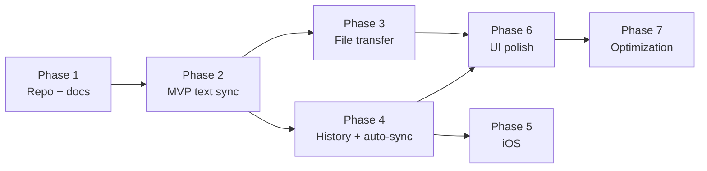
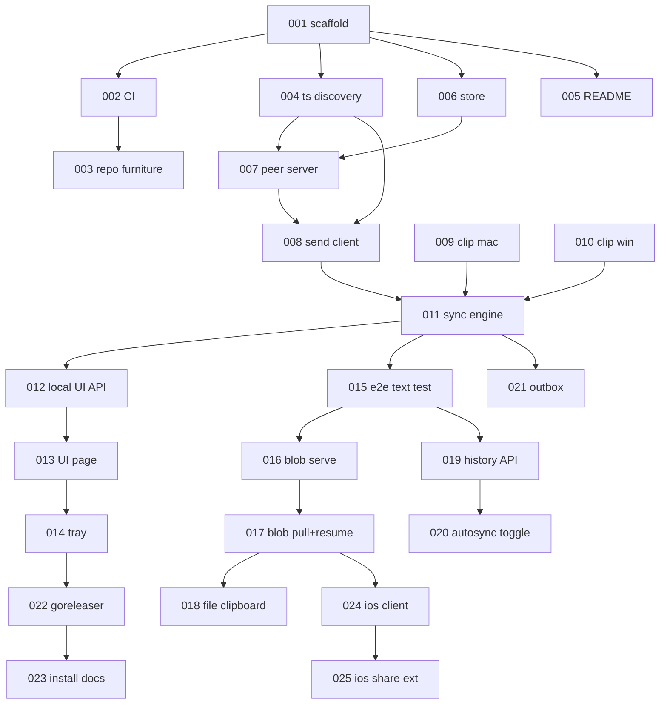

# YoYoPaste — Backlog

Master-node backlog. Workers pick the highest-priority task whose dependencies are **Done** and open one PR per task.

Read first: [`docs/ARCHITECTURE.md`](docs/ARCHITECTURE.md) (decisions D1–D10, protocol v0) and [`docs/STYLE.md`](docs/STYLE.md) (Ponytail rules — every PR is reviewed against the ladder).

## Legend

**Priority** P0 blocks the phase · P1 needed for the phase · P2 valuable · P3 nice-to-have
**Complexity** S ≈ 30 min · M ≈ 60 min · L ≈ 90 min. Anything larger is a planning bug — tell the master node to split it.
**Status** `Ready` `Blocked` `In progress` `Review` `Done`

## Phase map



## Dependency graph



---

# Phase 1 — Repository and documentation

### YYP-001 · Repository scaffold and Go module
**P0 · M · Ready · deps: none · skills: Go**

Create the repo skeleton and a daemon that starts, logs, and exits cleanly on SIGINT.

- `go.mod` module `github.com/Yeyo-N/YoYoPaste`, Go 1.23+.
- `cmd/yoyopasted/main.go` — flag parsing, structured logging via `log/slog`, `context` cancelled on SIGINT/SIGTERM.
- Empty packages with a doc comment each: `internal/peer`, `internal/store`, `internal/clip`, `internal/tsnet`.
- `.gitignore`, `LICENSE` (MIT), `.editorconfig`.

**Acceptance** `go build ./...` succeeds; `go run ./cmd/yoyopasted` logs a startup line and exits 0 on Ctrl-C.
**Test** none needed — no logic yet (YAGNI applies to tests too).
**Ponytail** `log/slog` only. No logging library, no config file, no DI container, no `internal/util`.

---

### YYP-002 · CI workflow
**P0 · M · Blocked by 001 · skills: GitHub Actions**

`.github/workflows/ci.yml`: on push and PR, matrix `ubuntu-latest, macos-latest, windows-latest`.

Steps: `gofmt -s -l .` (fails if output non-empty) → `go vet ./...` → `golangci-lint` with exactly the five linters in STYLE.md → `go test -race ./...`.

**Acceptance** Green on all three OSes. A deliberately unformatted file fails the run.
**Ponytail** One workflow file. No reusable workflows, no composite actions, no caching layer until a run exceeds 3 minutes.

---

### YYP-003 · Repository furniture
**P1 · S · Blocked by 002 · skills: Markdown**

`.github/ISSUE_TEMPLATE/bug_report.yml` and `feature_request.yml`, `.github/pull_request_template.md` (the PR checklist from STYLE.md, verbatim), `CONTRIBUTING.md`, `CODE_OF_CONDUCT.md` (Contributor Covenant 2.1 unmodified).

**Acceptance** Templates render in the GitHub UI; the PR template checklist matches STYLE.md.
**Ponytail** Copy the Covenant, do not write one. Two issue templates, not six.

---

### YYP-004 · Tailscale peer discovery
**P0 · L · Blocked by 001 · skills: Go, Tailscale**

`internal/tsnet` — the only place that talks to Tailscale.

```go
type Peer struct { ID, Name, OS string; IP netip.Addr; Online bool; LastSeen time.Time }

func SelfIP(ctx context.Context) (netip.Addr, error)   // our 100.x address; error if Tailscale is down
func Peers(ctx context.Context) ([]Peer, error)        // tailnet peers running any OS
func WhoIs(ctx context.Context, remoteAddr string) (Peer, error) // authenticates an inbound request
```

Use `tailscale.com/client/tailscale` LocalAPI. Filter `Peers` to nodes owned by the same user as self.

**Acceptance** On a machine with Tailscale up, `Peers` returns real devices with 100.x IPs. With Tailscale stopped, every function returns a distinguishable "tailscale unavailable" error, and nothing panics.
**Test** `tsnet_test.go` — `WhoIs` rejects a non-tailnet `RemoteAddr`; `Peers` filtering is table-driven against a fixture status struct.
**Ponytail** LocalAPI only (D7). No API key, no `tailscale` CLI shelling, no subnet scan, no mDNS.

---

### YYP-005 · README
**P1 · L · Blocked by 001 · skills: Markdown, design**

Banner, one-sentence pitch, badges (CI, license, release, downloads), feature list, per-platform install, the two Mermaid diagrams from ARCHITECTURE.md §3–4, security section ("your data never leaves your tailnet"), contributing link.

Leave a `<!-- demo gif -->` placeholder — the GIF lands in YYP-023 once there is something to record.

**Acceptance** Renders correctly on GitHub; every badge resolves; every install command is runnable as written.
**Ponytail** Mermaid renders natively on GitHub — do not commit rendered PNGs of the diagrams.

---

# Phase 2 — MVP: text between two devices

### YYP-006 · Store
**P0 · L · Blocked by 001 · skills: Go, SQLite**

`internal/store` over `modernc.org/sqlite` (pure Go — cgo would break cross-compilation).

Schema: `items(id TEXT PK, kind, mime, name, size, sha256, origin, created, inline BLOB, blob_path TEXT)`, `outbox(item_id, peer_id, attempts, last_try, PRIMARY KEY(item_id, peer_id))`.

```go
func Open(dir string) (*Store, error)          // creates dir 0700, db file 0600, migrates
func (s *Store) Put(it Item) error             // idempotent on id
func (s *Store) Recent(n int) ([]Item, error)  // newest first
func (s *Store) BySHA(sha string) (Item, bool, error) // dedupe
```

**Acceptance** Reopening a store preserves items; `Put` twice with one id inserts one row; db file mode is `0600`.
**Test** `store_test.go` against a `t.TempDir()` database. Real SQLite, no mocks.
**Ponytail** Migration = one `CREATE TABLE IF NOT EXISTS` block run at open. No migration framework, no ORM, no repository interface.

---

### YYP-007 · Peer HTTP server
**P0 · L · Blocked by 004, 006 · skills: Go, net/http**

`internal/peer` — serves protocol v0 (ARCHITECTURE.md §2) on the Tailscale IP only, port 8383.

Endpoints this task: `GET /v0/hello`, `POST /v0/clip`, `GET /v0/events` (SSE). Blob endpoints are YYP-016.

Middleware `authTailnet` calls `tsnet.WhoIs` on every request and returns `403` for unknown or foreign-tailnet callers.

**Acceptance** Bind address is the 100.x IP — a request to the LAN IP is refused at the socket, not by a handler. A forged `X-Forwarded-For` does not bypass `authTailnet`. `POST /v0/clip` persists via the store and returns `204`. Two SSE clients both receive an announcement.
**Test** `peer_test.go` — `httptest` server with a stub `WhoIs`; assert 403 path, 204 path, and SSE fan-out to two subscribers.
**Ponytail** `http.ServeMux` (Go 1.22 patterns). No router library, no middleware framework.

---

### YYP-008 · Peer send client
**P0 · M · Blocked by 007 · skills: Go**

`func Send(ctx context.Context, p tsnet.Peer, it store.Item) error` — POSTs `/v0/clip` with a 5 s timeout; text ≤4 KiB carries `inline`.

`func Broadcast(ctx, peers []tsnet.Peer, it store.Item) []error` — parallel, one goroutine per peer, `errgroup`-free (`sync.WaitGroup` + slice). One slow peer must not delay the others.

**Acceptance** Broadcast to 3 peers where one hangs still completes within the timeout and reports exactly one error.
**Test** `send_test.go` — `httptest` peers, one with a deliberate delay.
**Ponytail** One `http.Client` with `Timeout`, reused. No retry library — retries are YYP-021's outbox.

---

### YYP-009 · macOS clipboard watcher
**P0 · L · Blocked by 001 · skills: Go, cgo, AppKit**

`internal/clip/clip_darwin.go`. Poll `NSPasteboard.general.changeCount` every 500 ms (D5 — AppKit has no change event).

```go
func Watch(ctx context.Context) (<-chan Item, error)  // emits on change
func Set(it Item) error                                // writes the system clipboard
```

Text only in this task. Set a `suppress` flag while writing so our own write does not re-emit as a change.

**Acceptance** Copying in any app emits within 600 ms. `Set` followed by no user action emits nothing (no echo loop). Idle CPU under 0.1%.
**Test** `clip_darwin_test.go` — round-trip `Set` then read; skipped when `os.Getenv("CI")` has no window server.
**Ponytail** cgo against AppKit directly. No clipboard wrapper dependency. Poll an integer — that is the cheap part.

---

### YYP-010 · Windows clipboard watcher
**P0 · L · Blocked by 001 · skills: Go, Win32**

`internal/clip/clip_windows.go`. Same interface as YYP-009, but **event-driven**: `AddClipboardFormatListener` + a hidden message-only window pumping `WM_CLIPBOARDUPDATE`.

**Acceptance** Emits within 100 ms of a copy. No polling loop exists in this file. Same echo-suppression guarantee as 009.
**Test** Round-trip `Set`/read guarded by a `windows` build tag.
**Ponytail** `golang.org/x/sys/windows` syscalls. No CGO, no wrapper library.

---

### YYP-011 · Sync engine
**P0 · L · Blocked by 008, 009, 010 · skills: Go**

`internal/sync` — wires watcher → store → broadcast, and inbound announcement → store → (optionally) `clip.Set`.

Dedupe by `sha256`: an item already in the store is never re-broadcast. This is what stops two auto-syncing devices from ping-ponging a clipboard forever.

`func Run(ctx, deps) error` with an `Enabled(bool)` switch backing the on/off toggle. Disabled means the watcher stops and the peer server refuses new items — not "receive silently".

**Acceptance** Two daemons on one tailnet: copying on A puts the text in B's store within 100 ms. Loop test — with auto-sync on both, one copy produces exactly one item on each device and then stops.
**Test** `sync_test.go` — in-process A and B over `httptest`, assert no infinite echo.
**Ponytail** One goroutine and a `select`. No event bus, no pub/sub abstraction, no actor framework.

---

### YYP-012 · Local UI API
**P1 · M · Blocked by 011 · skills: Go**

Second listener on `127.0.0.1:8384` — never bound to the tailnet.

```
GET  /api/state   -> {"enabled":bool,"self":{…},"peers":[{name,ip,status,last_sync}]}
POST /api/toggle  -> {"enabled":bool}
```

**Acceptance** Reachable from localhost; a request to the Tailscale IP on 8384 is refused at the socket. `POST /api/toggle` flips the engine and the change is visible in the next `/api/state`.
**Test** `httptest` assertions on both handlers.
**Ponytail** Two endpoints. No REST resource modelling, no OpenAPI spec, no auth on a loopback-only listener.

---

### YYP-013 · Local UI page
**P1 · L · Blocked by 012 · skills: HTML, CSS, vanilla JS**

Single `internal/ui/index.html`, served via `embed.FS`. Exactly the mockup in ARCHITECTURE.md §5: title, status dot, ON/OFF toggle, GitHub icon linking to the repo, one device table.

Poll `/api/state` every 2 s. System light/dark via `prefers-color-scheme`.

**Acceptance** Toggle reflects state within 2 s. Table shows name, IP, status, relative last-sync. Keyboard reachable, toggle has an accessible name, contrast ≥4.5:1. No settings UI of any kind.
**Ponytail** One file, no build step, no framework, no npm, no bundler. `fetch` + `setInterval` is the entire client.

---

### YYP-014 · System tray
**P1 · L · Blocked by 013 · skills: Go, `fyne.io/systray`**

Tray icon with state-reflecting art (on/off/error) and a menu: **Enabled** (checkbox), **Open YoYoPaste** (opens `http://127.0.0.1:8384`), **Auto-sync** (checkbox, wired in YYP-020), separator, **Quit**.

**Acceptance** Icon appears in the macOS menu bar and Windows notification area. Menu state matches the engine after toggling from the web page. Quit shuts down cleanly.
**Ponytail** `systray` only. No windowing toolkit, no Tauri, no webview — "Open" hands the URL to the OS browser.

---

### YYP-015 · Two-device end-to-end text test
**P0 · M · Blocked by 011 · skills: Go, testing**

`e2e/text_test.go` — start two daemons in one process on loopback with a stub `tsnet` (fake peers, `WhoIs` always allows). Assert a text item crosses in <100 ms and dedupe holds on a repeat.

**Acceptance** Passes in CI on all three OSes with no Tailscale installed. Fails if the sync engine regresses.
**Ponytail** Stub the tsnet boundary only. Everything else is the real code — a test that mocks the store is testing the mock.

---

# Phase 3 — File transfer

### YYP-016 · Blob serving with Range
**P1 · M · Blocked by 015 · skills: Go**

`GET|HEAD /v0/blob/{id}` in `internal/peer`, backed by `http.ServeContent` against the file at `items.blob_path`.

**Acceptance** `Range: bytes=100-199` returns `206` with exactly 100 bytes and a correct `Content-Range`. `HEAD` returns the size and `Accept-Ranges: bytes`. An id outside the store returns `404` and never touches the filesystem (path traversal).
**Test** Range, HEAD, 404, and a `../` id attempt.
**Ponytail** `http.ServeContent` implements ranges, conditional requests and `Content-Type` sniffing. Writing a range parser here would be the bug.

---

### YYP-017 · Blob pull with resume
**P1 · L · Blocked by 016 · skills: Go**

Receiver side: on an announcement with no `inline`, download from `origin` into `<blobdir>/<id>.part` using `Range: bytes=<current size>-`, verify `sha256`, then rename to final. On failure, retry with backoff — each attempt restarts from the new part size, so progress is never lost.

**Acceptance** Killing the transfer at 50% and restarting resumes rather than restarting. A corrupted payload fails the sha256 check, is discarded, and does not enter the store. A 5 GB file transfers with daemon RSS staying under 200 MB.
**Test** `httptest` origin that closes the connection mid-body; assert the retry sends `Range: bytes=N-` with N>0 and the final file matches.
**Ponytail** `io.Copy` into an `os.File` opened `O_APPEND`. Never `io.ReadAll` a payload — that is the memory target, gone.

---

### YYP-018 · File clipboard integration
**P1 · L · Blocked by 017 · skills: Go, cgo, Win32**

Extend the watchers: read file references from the pasteboard (`NSFilenamesPboardType` / `CF_HDROP`) and write received files back as pasteable file references. Save incoming files to the OS Downloads directory.

**Acceptance** Copy a file on A → paste it in Explorer/Finder on B. Filenames with spaces, unicode and emoji survive. Copying 200 files at once does not stall the watcher.
**Ponytail** File references only. Do not implement drag-and-drop here — that is YYP-026 and needs a window.

---

# Phase 4 — History and auto-sync

### YYP-019 · History API and view
**P1 · M · Blocked by 015 · skills: Go, HTML**

`GET /api/history?n=50` → recent items (metadata plus text preview, never full blobs). `POST /api/history/{id}/copy` puts an item back on the local clipboard.

Add a collapsed history list beneath the device table in `index.html` — the table stays the default view.

**Acceptance** 50 entries render; clicking one sets the local clipboard; eviction keeps the store bounded (default 500 items / 2 GB of blobs, oldest first).
**Ponytail** One `LIMIT` query. No pagination, no search, no filters until someone asks.

---

### YYP-020 · Auto-sync toggle
**P1 · S · Blocked by 019 · skills: Go**

Persist an `autosync` bool in the store. When on, inbound items call `clip.Set`; when off, they are stored only. Wire the tray checkbox from YYP-014.

**Acceptance** Setting survives restart. Off = nothing touches the local clipboard. On = the loop test from YYP-011 still terminates.
**Ponytail** One row in a `settings` table. No config file, no settings screen (this is the *only* preference, and it lives in the tray).

---

### YYP-021 · Offline outbox
**P1 · L · Blocked by 011 · skills: Go**

On send failure, write to `outbox`. A watcher on `tsnet.Peers` drains a peer's outbox oldest-first when it comes online. Drop entries after 24 h or 20 attempts.

**Acceptance** Copy on A while B is offline; B receives it within 10 s of coming back. Ordering preserved. Restarting A does not lose the queue.
**Test** `outbox_test.go` — a peer that fails N times then succeeds; assert delivery order and attempt capping.
**Ponytail** Announcements are queued; blobs are not (D4 — the receiver pulls when ready). A queue entry is ~200 bytes, so no size management is needed.

---

# Phase 5 — Release and iOS

### YYP-022 · Release automation
**P1 · L · Blocked by 014 · skills: goreleaser, GitHub Actions**

`.goreleaser.yaml` + a tag-triggered workflow. macOS universal binary (signed + notarized if secrets are present, unsigned otherwise), Windows amd64/arm64. Changelog from Conventional Commit subjects.

**Acceptance** Pushing `v0.1.0` produces a GitHub Release with artifacts for both platforms and a grouped changelog.
**Ponytail** goreleaser does changelog, checksums, archives and the release. Do not script any of that.

---

### YYP-023 · Install docs and demo GIF
**P2 · M · Blocked by 022 · skills: docs, screen recording**

One install command per platform (`brew install --cask`, `winget install`). Record a ≤10 s GIF: copy on Mac → paste on Windows. Replace the README placeholder.

**Acceptance** A clean machine reaches a working install by following the README alone. GIF under 3 MB.

---

### YYP-024 · iOS client
**P2 · L · Blocked by 017 · skills: Swift, SwiftUI**

`ios/YoYoPaste` — SwiftUI app speaking protocol v0 over the Tailscale iOS VPN. Same four UI elements. Uses `URLSession` `async/await`; background transfers via `URLSessionConfiguration.background`.

**Acceptance** Sees desktop peers, sends and receives text and files. Battery impact negligible when backgrounded (no background polling — iOS foreground/share-extension only).
**Ponytail** Native Swift client, ~200 lines of networking. No gomobile, no shared Go core (D8) — the protocol is the contract.

---

### YYP-025 · iOS share extension
**P2 · L · Blocked by 024 · skills: Swift, App Extensions**

Share sheet target accepting text, URLs, images and files; posts to the selected peer and dismisses.

**Acceptance** Sharing a photo from Photos lands it on a desktop peer. Extension memory stays under the 120 MB share-extension limit for a 1 GB file (stream from the file URL, never load it).

---

# Phase 2.5 — Review remediation (YYP-001..022 shipped with defects)

All of Phase 1–4 is implemented and green (`go build`, `go vet`, `go test -race` all pass).
These tasks fix what the review found. **YYP-032 through YYP-035 block all further
feature work** — do them before YYP-024.

### YYP-032 · Fix ULID entropy — IDs collide within a millisecond
**P0 · S · Ready · deps: none · skills: Go**

`ulid.MustNew(ulid.Now(), nil)` passes a nil entropy reader, producing all-zero
entropy. Verified: two calls in the same millisecond both return
`01M1ZXNVJZ0000000000000000`. Because `store.Put` is `INSERT OR IGNORE` on the
primary key, **two clipboard items copied in the same millisecond silently
collapse into one — the second is lost.** IDs are also fully predictable.

Sites: `internal/clip/clip_darwin.go:74`, `internal/clip/clip_windows.go:108`,
`internal/sync/engine.go:156`.

**Fix** Replace all three with `ulid.Make()` (crypto-seeded, monotonic).
**Acceptance** A test generating 10 000 IDs in a tight loop yields 10 000 distinct values.
**Ponytail** `ulid.Make()` is the one-line form. Do not build an ID service.

---

### YYP-033 · CI is red on its own repository
**P0 · S · Ready · deps: none · skills: Go**

`.github/workflows/ci.yml` gates on `gofmt -s -l .`, and eight committed files
fail it: `e2e/text_test.go`, `internal/clip/clip_windows.go`,
`internal/peer/blob_test.go`, `internal/peer/pull.go`, `internal/sync/sync_test.go`,
`internal/tsnet/tsnet_test.go`, `internal/ui/server.go`, `internal/ui/ui_test.go`.
Several test files are written with no spaces around tokens at all.

**Fix** `gofmt -s -w .`. Then confirm the workflow actually ran and went green —
it has never passed, because nothing was ever pushed to trigger it.
**Acceptance** Green CI run on all three OSes, visible in the Actions tab.

---

### YYP-034 · authTailnet accepts any tailnet node, not just ours
**P0 · M · Ready · deps: none · skills: Go, Tailscale**

`internal/peer/server.go:authTailnet` calls `tsnet.WhoIs` and accepts on any
non-error result. ARCHITECTURE.md §2 requires rejecting "a caller outside the
tailnet **or belonging to another user**". `tsnet.Peers` filters on `UserID`;
`WhoIs` does not. A shared node, a tagged device, or any other user on a
multi-user tailnet currently passes authentication and can read and write
clipboard history.

This is the entire authentication system (D3/D7 — there is no second layer
behind it), so it has to be exactly right.

**Fix** Return the owning `UserID` from `tsnet.WhoIs` and compare it to
`Status().Self.UserID` in the middleware. Reject mismatches with 403.
**Acceptance** Table-driven test: same-user node → 200; different `UserID` → 403;
`WhoIs` error → 403. Log rejections once per peer, not per request.
**Ponytail** Do not add tokens or a pairing flow. The tailnet already knows who
the caller is — this is a comparison we forgot to make, not a missing subsystem.

---

### YYP-035 · POST /v0/clip has no body limit
**P0 · S · Ready · deps: none · skills: Go**

`handleClip` calls `json.NewDecoder(r.Body).Decode(&it)` with no
`http.MaxBytesReader`. `inline` is a `[]byte` with no size check, so an
authenticated peer (or anything that gets past YYP-034) can force unbounded
allocation. Protocol v0 caps `inline` at 4 KiB; nothing enforces it.

STYLE.md forbids simplifying away validation at a trust boundary. This is one.

**Fix** Wrap the body in `http.MaxBytesReader(w, r.Body, 64<<10)` and reject
`len(it.Inline) > 4096` with 400.
**Acceptance** A 1 MiB POST returns 413 and allocates no more than the cap.

---

### YYP-036 · Dedupe is permanent, so re-copying old text silently fails
**P1 · M · Ready · deps: 032 · skills: Go**

`engine.handleWatcherItem` and `handleInbound` both dedupe with
`store.BySHA(...)` against **all history**. Copy "hello", copy something else,
copy "hello" again → the second "hello" matches an existing row and is dropped.
It never reaches the other device, with no error shown.

The SHA check is doing double duty: breaking the echo loop (correct) and
deduping history (wrong). Only the first is needed.

**Fix** Scope the check to loop-breaking: compare against the most recent item
only, or against items seen in the last ~2 seconds. History keeps every copy.
**Acceptance** Test: copy A, copy B, copy A again → three items stored and A is
broadcast twice. The existing echo-loop test must still terminate.

---

### YYP-037 · Blob resume corrupts the file when the peer ignores Range
**P1 · M · Ready · deps: none · skills: Go**

`internal/peer/pull.go:downloadChunk` opens the `.part` file `O_APPEND` and
copies the response body without checking the status code against the offset.
If the origin answers `200 OK` instead of `206` while `offset > 0` — an
unsatisfiable range, a proxy, an older peer — the **full** body is appended to
the partial data. `verifyAndFinalize` then fails on size, deletes the part file,
and `Pull` returns immediately without retrying. The transfer is permanently lost.

Two more problems in the same function: retries are capped at 5 with 200 ms–1 s
backoff, so a real network drop exhausts them in about 3 seconds; and the
in-code comment concedes this ("for test; real code would retry indefinitely").

**Fix** If `offset > 0` and the status is 200, truncate the part file before
copying. Let a verification failure retry rather than return. Raise the budget to
a time-bounded retry (e.g. 10 minutes of exponential backoff, capped at 30 s).
**Acceptance** Test: an origin that ignores `Range` and returns 200 still
produces a correct final file. A mid-transfer connection drop resumes and completes.

---

### YYP-038 · Data race on the macOS clipboard suppress flag
**P1 · S · Ready · deps: none · skills: Go**

`internal/clip/clip_darwin.go:39` declares `var suppress bool`, written by
`Set` (caller's goroutine) and read by the 500 ms poll goroutine with no
synchronisation. `go test -race` does not catch it because `internal/clip` has
**no test files at all** — YYP-009 required `clip_darwin_test.go` and it was
never written.

**Fix** `var suppress atomic.Bool`. Add the round-trip test YYP-009 specified,
skipped when there is no window server.
**Acceptance** `go test -race ./internal/clip/...` passes and actually exercises
`Set` concurrently with the watcher.

---

### YYP-039 · History ordering is wrong for same-second items
**P2 · S · Ready · deps: none · skills: Go, SQLite**

`created` is stored as `time.RFC3339Nano` text and ordered with
`ORDER BY created DESC` — a string sort. Go trims trailing zeros from the
fractional part, so `...:00.5Z` and `...:00.50001Z` compare as `'Z' > '0'`,
putting `.5` after `.50001`. History order and retention's "oldest first" are
both wrong for items in the same second.

**Fix** Store `created` as INTEGER Unix nanoseconds. One migration, one
`ORDER BY`.
**Acceptance** Test inserting items microseconds apart and asserting `Recent`
order.

---

### YYP-040 · Cleanups
**P2 · M · Ready · deps: none · skills: Go**

- `internal/peer/server.go` ends with `var _ = netip.Addr{}` — dead code
  propping up an import that should just be deleted.
- `handleHello` returns hardcoded `"id":"self"`, `"name":"yoyopaste"`,
  `"os":"unknown"`. Either return real identity from `tsnet.SelfIP`/`Status`, or
  delete the endpoint and protocol v0 with it — nothing calls it.
- `engine.handleInbound` contains three comment lines of the worker reasoning
  with itself about what the spec meant. Delete them; keep the code.
- `store.Put` runs `EnforceRetention` — `COUNT(*)` plus `SUM(size)` — on every
  single insert, and loads every row into memory when over the cap. Move it to a
  ticker, or run it every Nth insert.
- `engine.handleWatcherItem` broadcasts to offline peers, relying on the 5 s
  timeout to fail. Filter on `p.Online` and queue straight to the outbox.
- `sync_test.go:TestOutboxQueueOnBroadcastFail` does not test its own name — the
  worker's comment admits it could not set up the scenario, so it calls
  `AddOutbox` directly and never asserts that entries are dropped after 20
  attempts. Either write the real test or rename it honestly.

**Ponytail** This is a deletion task. The diff should be net negative.

---

# Phase 6+ — Polish and optimization (not yet broken down)

| ID | Task | P | Cx |
|----|------|---|-----|
| YYP-026 | Desktop drag-and-drop target window | P3 | L |
| YYP-027 | Tray icon art + app iconography, all densities | P3 | M |
| YYP-028 | Cold-start budget: measure and hold under 2 s | P3 | M |
| YYP-029 | Blob dir GC + configurable retention cap | P3 | M |
| YYP-030 | GitHub Wiki: protocol reference, troubleshooting, FAQ | P2 | L |
| YYP-031 | Graphify pass over the real codebase → dependency graph in `docs/` | P3 | M |
| YYP-041 | Two-machine manual verification: Mac ↔ Windows, real Tailscale | P0 | L |

---

## Development environment

```bash
# prerequisites
brew install go golangci-lint goreleaser        # macOS
winget install GoLang.Go                         # Windows
# Tailscale must be installed, running and logged in on every dev machine

git clone https://github.com/Yeyo-N/YoYoPaste.git
cd YoYoPaste
go mod download
go build ./... && go test ./...
go run ./cmd/yoyopasted -v        # then open http://127.0.0.1:8384
```

Two devices are required for any Phase 2+ task. If you have only one, `e2e/` (YYP-015) runs both daemons in a single process with a stubbed tailnet.

**iOS:** Xcode 16+, an Apple Developer account for device testing, and the Tailscale iOS app logged into the same tailnet.

## Worker protocol

0. **Commit your work.** One PR per task, on a branch. Work left uncommitted in the working tree has not been delivered.
1. Claim a `Ready` task by setting it `In progress` in this file, in the first commit of your branch. (Outside contributors: open an issue instead.)
2. Branch `yyp-NNN-short-slug`. One task, one PR.
3. Run `gofmt -s -w .` before every commit — CI gates on it. Follow STYLE.md. The PR body must name anything you deliberately skipped and the condition that would justify adding it.
4. Set `Review` and request the master node. The master node marks `Done` and unblocks dependents.
5. Blocked or the task turns out to be larger than L? Stop and say so — do not expand scope inside a PR.
