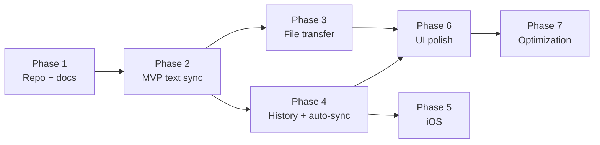
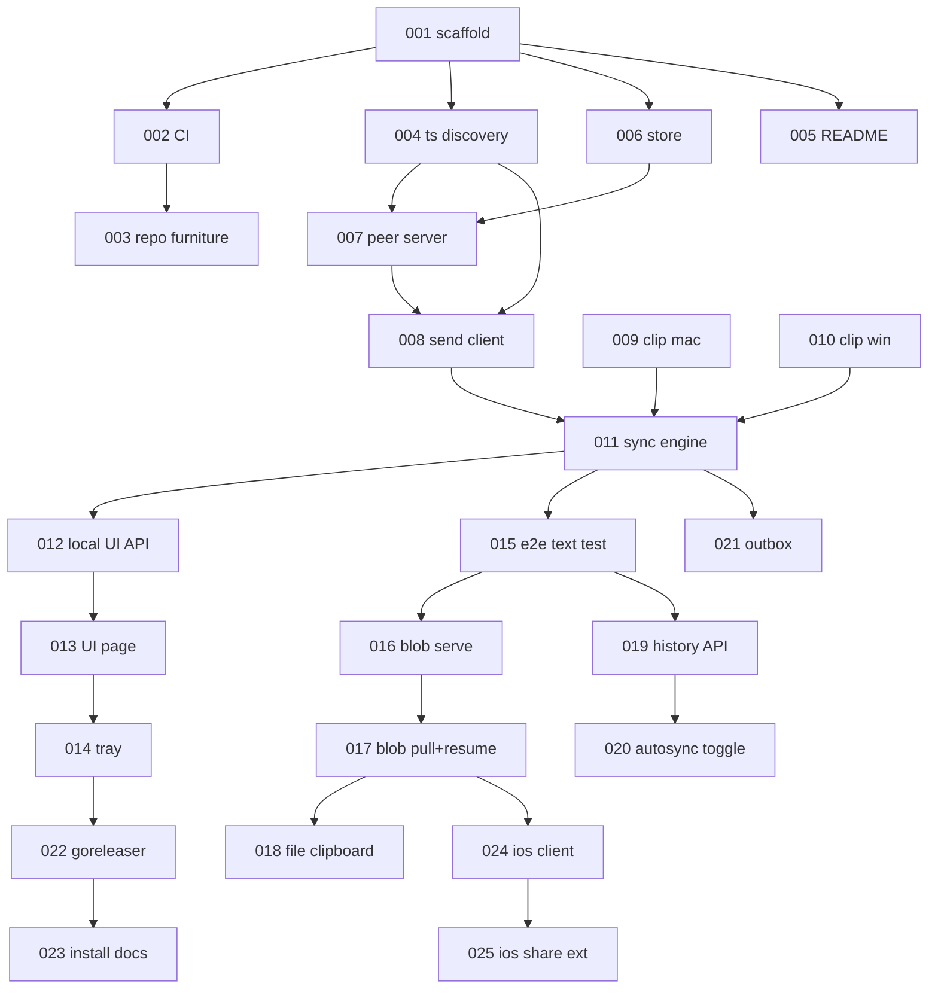

# YoYoPaste — Backlog

Master-node backlog. Workers pick the highest-priority task whose dependencies are **Done** and open one PR per task.

Read first: [`docs/ARCHITECTURE.md`](docs/ARCHITECTURE.md) (decisions D1–D10, protocol v0) and [`docs/STYLE.md`](docs/STYLE.md) (Ponytail rules — every PR is reviewed against the ladder).

## Legend

**Priority** P0 blocks the phase · P1 needed for the phase · P2 valuable · P3 nice-to-have
**Complexity** S ≈ 30 min · M ≈ 60 min · L ≈ 90 min. Anything larger is a planning bug — tell the master node to split it.
**Status** `Ready` `Blocked` `In progress` `Review` `Done`

## Phase map



## Dependency graph



---

# Phase 1 — Repository and documentation

### YYP-001 · Repository scaffold and Go module
**P0 · M · Ready · deps: none · skills: Go**

Create the repo skeleton and a daemon that starts, logs, and exits cleanly on SIGINT.

- `go.mod` module `github.com/Yeyo-N/YoYoPaste`, Go 1.23+.
- `cmd/yoyopasted/main.go` — flag parsing, structured logging via `log/slog`, `context` cancelled on SIGINT/SIGTERM.
- Empty packages with a doc comment each: `internal/peer`, `internal/store`, `internal/clip`, `internal/tsnet`.
- `.gitignore`, `LICENSE` (MIT), `.editorconfig`.

**Acceptance** `go build ./...` succeeds; `go run ./cmd/yoyopasted` logs a startup line and exits 0 on Ctrl-C.
**Test** none needed — no logic yet (YAGNI applies to tests too).
**Ponytail** `log/slog` only. No logging library, no config file, no DI container, no `internal/util`.

---

### YYP-002 · CI workflow
**P0 · M · Blocked by 001 · skills: GitHub Actions**

`.github/workflows/ci.yml`: on push and PR, matrix `ubuntu-latest, macos-latest, windows-latest`.

Steps: `gofmt -s -l .` (fails if output non-empty) → `go vet ./...` → `golangci-lint` with exactly the five linters in STYLE.md → `go test -race ./...`.

**Acceptance** Green on all three OSes. A deliberately unformatted file fails the run.
**Ponytail** One workflow file. No reusable workflows, no composite actions, no caching layer until a run exceeds 3 minutes.

---

### YYP-003 · Repository furniture
**P1 · S · Blocked by 002 · skills: Markdown**

`.github/ISSUE_TEMPLATE/bug_report.yml` and `feature_request.yml`, `.github/pull_request_template.md` (the PR checklist from STYLE.md, verbatim), `CONTRIBUTING.md`, `CODE_OF_CONDUCT.md` (Contributor Covenant 2.1 unmodified).

**Acceptance** Templates render in the GitHub UI; the PR template checklist matches STYLE.md.
**Ponytail** Copy the Covenant, do not write one. Two issue templates, not six.

---

### YYP-004 · Tailscale peer discovery
**P0 · L · Blocked by 001 · skills: Go, Tailscale**

`internal/tsnet` — the only place that talks to Tailscale.

```go
type Peer struct { ID, Name, OS string; IP netip.Addr; Online bool; LastSeen time.Time }

func SelfIP(ctx context.Context) (netip.Addr, error)   // our 100.x address; error if Tailscale is down
func Peers(ctx context.Context) ([]Peer, error)        // tailnet peers running any OS
func WhoIs(ctx context.Context, remoteAddr string) (Peer, error) // authenticates an inbound request
```

Use `tailscale.com/client/tailscale` LocalAPI. Filter `Peers` to nodes owned by the same user as self.

**Acceptance** On a machine with Tailscale up, `Peers` returns real devices with 100.x IPs. With Tailscale stopped, every function returns a distinguishable "tailscale unavailable" error, and nothing panics.
**Test** `tsnet_test.go` — `WhoIs` rejects a non-tailnet `RemoteAddr`; `Peers` filtering is table-driven against a fixture status struct.
**Ponytail** LocalAPI only (D7). No API key, no `tailscale` CLI shelling, no subnet scan, no mDNS.

---

### YYP-005 · README
**P1 · L · Blocked by 001 · skills: Markdown, design**

Banner, one-sentence pitch, badges (CI, license, release, downloads), feature list, per-platform install, the two Mermaid diagrams from ARCHITECTURE.md §3–4, security section ("your data never leaves your tailnet"), contributing link.

Leave a `<!-- demo gif -->` placeholder — the GIF lands in YYP-023 once there is something to record.

**Acceptance** Renders correctly on GitHub; every badge resolves; every install command is runnable as written.
**Ponytail** Mermaid renders natively on GitHub — do not commit rendered PNGs of the diagrams.

---

# Phase 2 — MVP: text between two devices

### YYP-006 · Store
**P0 · L · Blocked by 001 · skills: Go, SQLite**

`internal/store` over `modernc.org/sqlite` (pure Go — cgo would break cross-compilation).

Schema: `items(id TEXT PK, kind, mime, name, size, sha256, origin, created, inline BLOB, blob_path TEXT)`, `outbox(item_id, peer_id, attempts, last_try, PRIMARY KEY(item_id, peer_id))`.

```go
func Open(dir string) (*Store, error)          // creates dir 0700, db file 0600, migrates
func (s *Store) Put(it Item) error             // idempotent on id
func (s *Store) Recent(n int) ([]Item, error)  // newest first
func (s *Store) BySHA(sha string) (Item, bool, error) // dedupe
```

**Acceptance** Reopening a store preserves items; `Put` twice with one id inserts one row; db file mode is `0600`.
**Test** `store_test.go` against a `t.TempDir()` database. Real SQLite, no mocks.
**Ponytail** Migration = one `CREATE TABLE IF NOT EXISTS` block run at open. No migration framework, no ORM, no repository interface.

---

### YYP-007 · Peer HTTP server
**P0 · L · Blocked by 004, 006 · skills: Go, net/http**

`internal/peer` — serves protocol v0 (ARCHITECTURE.md §2) on the Tailscale IP only, port 8383.

Endpoints this task: `GET /v0/hello`, `POST /v0/clip`, `GET /v0/events` (SSE). Blob endpoints are YYP-016.

Middleware `authTailnet` calls `tsnet.WhoIs` on every request and returns `403` for unknown or foreign-tailnet callers.

**Acceptance** Bind address is the 100.x IP — a request to the LAN IP is refused at the socket, not by a handler. A forged `X-Forwarded-For` does not bypass `authTailnet`. `POST /v0/clip` persists via the store and returns `204`. Two SSE clients both receive an announcement.
**Test** `peer_test.go` — `httptest` server with a stub `WhoIs`; assert 403 path, 204 path, and SSE fan-out to two subscribers.
**Ponytail** `http.ServeMux` (Go 1.22 patterns). No router library, no middleware framework.

---

### YYP-008 · Peer send client
**P0 · M · Blocked by 007 · skills: Go**

`func Send(ctx context.Context, p tsnet.Peer, it store.Item) error` — POSTs `/v0/clip` with a 5 s timeout; text ≤4 KiB carries `inline`.

`func Broadcast(ctx, peers []tsnet.Peer, it store.Item) []error` — parallel, one goroutine per peer, `errgroup`-free (`sync.WaitGroup` + slice). One slow peer must not delay the others.

**Acceptance** Broadcast to 3 peers where one hangs still completes within the timeout and reports exactly one error.
**Test** `send_test.go` — `httptest` peers, one with a deliberate delay.
**Ponytail** One `http.Client` with `Timeout`, reused. No retry library — retries are YYP-021's outbox.

---

### YYP-009 · macOS clipboard watcher
**P0 · L · Blocked by 001 · skills: Go, cgo, AppKit**

`internal/clip/clip_darwin.go`. Poll `NSPasteboard.general.changeCount` every 500 ms (D5 — AppKit has no change event).

```go
func Watch(ctx context.Context) (<-chan Item, error)  // emits on change
func Set(it Item) error                                // writes the system clipboard
```

Text only in this task. Set a `suppress` flag while writing so our own write does not re-emit as a change.

**Acceptance** Copying in any app emits within 600 ms. `Set` followed by no user action emits nothing (no echo loop). Idle CPU under 0.1%.
**Test** `clip_darwin_test.go` — round-trip `Set` then read; skipped when `os.Getenv("CI")` has no window server.
**Ponytail** cgo against AppKit directly. No clipboard wrapper dependency. Poll an integer — that is the cheap part.

---

### YYP-010 · Windows clipboard watcher
**P0 · L · Blocked by 001 · skills: Go, Win32**

`internal/clip/clip_windows.go`. Same interface as YYP-009, but **event-driven**: `AddClipboardFormatListener` + a hidden message-only window pumping `WM_CLIPBOARDUPDATE`.

**Acceptance** Emits within 100 ms of a copy. No polling loop exists in this file. Same echo-suppression guarantee as 009.
**Test** Round-trip `Set`/read guarded by a `windows` build tag.
**Ponytail** `golang.org/x/sys/windows` syscalls. No CGO, no wrapper library.

---

### YYP-011 · Sync engine
**P0 · L · Blocked by 008, 009, 010 · skills: Go**

`internal/sync` — wires watcher → store → broadcast, and inbound announcement → store → (optionally) `clip.Set`.

Dedupe by `sha256`: an item already in the store is never re-broadcast. This is what stops two auto-syncing devices from ping-ponging a clipboard forever.

`func Run(ctx, deps) error` with an `Enabled(bool)` switch backing the on/off toggle. Disabled means the watcher stops and the peer server refuses new items — not "receive silently".

**Acceptance** Two daemons on one tailnet: copying on A puts the text in B's store within 100 ms. Loop test — with auto-sync on both, one copy produces exactly one item on each device and then stops.
**Test** `sync_test.go` — in-process A and B over `httptest`, assert no infinite echo.
**Ponytail** One goroutine and a `select`. No event bus, no pub/sub abstraction, no actor framework.

---

### YYP-012 · Local UI API
**P1 · M · Blocked by 011 · skills: Go**

Second listener on `127.0.0.1:8384` — never bound to the tailnet.

```
GET  /api/state   -> {"enabled":bool,"self":{…},"peers":[{name,ip,status,last_sync}]}
POST /api/toggle  -> {"enabled":bool}
```

**Acceptance** Reachable from localhost; a request to the Tailscale IP on 8384 is refused at the socket. `POST /api/toggle` flips the engine and the change is visible in the next `/api/state`.
**Test** `httptest` assertions on both handlers.
**Ponytail** Two endpoints. No REST resource modelling, no OpenAPI spec, no auth on a loopback-only listener.

---

### YYP-013 · Local UI page
**P1 · L · Blocked by 012 · skills: HTML, CSS, vanilla JS**

Single `internal/ui/index.html`, served via `embed.FS`. Exactly the mockup in ARCHITECTURE.md §5: title, status dot, ON/OFF toggle, GitHub icon linking to the repo, one device table.

Poll `/api/state` every 2 s. System light/dark via `prefers-color-scheme`.

**Acceptance** Toggle reflects state within 2 s. Table shows name, IP, status, relative last-sync. Keyboard reachable, toggle has an accessible name, contrast ≥4.5:1. No settings UI of any kind.
**Ponytail** One file, no build step, no framework, no npm, no bundler. `fetch` + `setInterval` is the entire client.

---

### YYP-014 · System tray
**P1 · L · Blocked by 013 · skills: Go, `fyne.io/systray`**

Tray icon with state-reflecting art (on/off/error) and a menu: **Enabled** (checkbox), **Open YoYoPaste** (opens `http://127.0.0.1:8384`), **Auto-sync** (checkbox, wired in YYP-020), separator, **Quit**.

**Acceptance** Icon appears in the macOS menu bar and Windows notification area. Menu state matches the engine after toggling from the web page. Quit shuts down cleanly.
**Ponytail** `systray` only. No windowing toolkit, no Tauri, no webview — "Open" hands the URL to the OS browser.

---

### YYP-015 · Two-device end-to-end text test
**P0 · M · Blocked by 011 · skills: Go, testing**

`e2e/text_test.go` — start two daemons in one process on loopback with a stub `tsnet` (fake peers, `WhoIs` always allows). Assert a text item crosses in <100 ms and dedupe holds on a repeat.

**Acceptance** Passes in CI on all three OSes with no Tailscale installed. Fails if the sync engine regresses.
**Ponytail** Stub the tsnet boundary only. Everything else is the real code — a test that mocks the store is testing the mock.

---

# Phase 3 — File transfer

### YYP-016 · Blob serving with Range
**P1 · M · Blocked by 015 · skills: Go**

`GET|HEAD /v0/blob/{id}` in `internal/peer`, backed by `http.ServeContent` against the file at `items.blob_path`.

**Acceptance** `Range: bytes=100-199` returns `206` with exactly 100 bytes and a correct `Content-Range`. `HEAD` returns the size and `Accept-Ranges: bytes`. An id outside the store returns `404` and never touches the filesystem (path traversal).
**Test** Range, HEAD, 404, and a `../` id attempt.
**Ponytail** `http.ServeContent` implements ranges, conditional requests and `Content-Type` sniffing. Writing a range parser here would be the bug.

---

### YYP-017 · Blob pull with resume
**P1 · L · Blocked by 016 · skills: Go**

Receiver side: on an announcement with no `inline`, download from `origin` into `<blobdir>/<id>.part` using `Range: bytes=<current size>-`, verify `sha256`, then rename to final. On failure, retry with backoff — each attempt restarts from the new part size, so progress is never lost.

**Acceptance** Killing the transfer at 50% and restarting resumes rather than restarting. A corrupted payload fails the sha256 check, is discarded, and does not enter the store. A 5 GB file transfers with daemon RSS staying under 200 MB.
**Test** `httptest` origin that closes the connection mid-body; assert the retry sends `Range: bytes=N-` with N>0 and the final file matches.
**Ponytail** `io.Copy` into an `os.File` opened `O_APPEND`. Never `io.ReadAll` a payload — that is the memory target, gone.

---

### YYP-018 · File clipboard integration
**P1 · L · Blocked by 017 · skills: Go, cgo, Win32**

Extend the watchers: read file references from the pasteboard (`NSFilenamesPboardType` / `CF_HDROP`) and write received files back as pasteable file references. Save incoming files to the OS Downloads directory.

**Acceptance** Copy a file on A → paste it in Explorer/Finder on B. Filenames with spaces, unicode and emoji survive. Copying 200 files at once does not stall the watcher.
**Ponytail** File references only. Do not implement drag-and-drop here — that is YYP-026 and needs a window.

---

# Phase 4 — History and auto-sync

### YYP-019 · History API and view
**P1 · M · Blocked by 015 · skills: Go, HTML**

`GET /api/history?n=50` → recent items (metadata plus text preview, never full blobs). `POST /api/history/{id}/copy` puts an item back on the local clipboard.

Add a collapsed history list beneath the device table in `index.html` — the table stays the default view.

**Acceptance** 50 entries render; clicking one sets the local clipboard; eviction keeps the store bounded (default 500 items / 2 GB of blobs, oldest first).
**Ponytail** One `LIMIT` query. No pagination, no search, no filters until someone asks.

---

### YYP-020 · Auto-sync toggle
**P1 · S · Blocked by 019 · skills: Go**

Persist an `autosync` bool in the store. When on, inbound items call `clip.Set`; when off, they are stored only. Wire the tray checkbox from YYP-014.

**Acceptance** Setting survives restart. Off = nothing touches the local clipboard. On = the loop test from YYP-011 still terminates.
**Ponytail** One row in a `settings` table. No config file, no settings screen (this is the *only* preference, and it lives in the tray).

---

### YYP-021 · Offline outbox
**P1 · L · Blocked by 011 · skills: Go**

On send failure, write to `outbox`. A watcher on `tsnet.Peers` drains a peer's outbox oldest-first when it comes online. Drop entries after 24 h or 20 attempts.

**Acceptance** Copy on A while B is offline; B receives it within 10 s of coming back. Ordering preserved. Restarting A does not lose the queue.
**Test** `outbox_test.go` — a peer that fails N times then succeeds; assert delivery order and attempt capping.
**Ponytail** Announcements are queued; blobs are not (D4 — the receiver pulls when ready). A queue entry is ~200 bytes, so no size management is needed.

---

# Phase 5 — Release and iOS

### YYP-022 · Release automation
**P1 · L · Blocked by 014 · skills: goreleaser, GitHub Actions**

`.goreleaser.yaml` + a tag-triggered workflow. macOS universal binary (signed + notarized if secrets are present, unsigned otherwise), Windows amd64/arm64. Changelog from Conventional Commit subjects.

**Acceptance** Pushing `v0.1.0` produces a GitHub Release with artifacts for both platforms and a grouped changelog.
**Ponytail** goreleaser does changelog, checksums, archives and the release. Do not script any of that.

---

### YYP-023 · Install docs and demo GIF
**P2 · M · Blocked by 022 · skills: docs, screen recording**

One install command per platform (`brew install --cask`, `winget install`). Record a ≤10 s GIF: copy on Mac → paste on Windows. Replace the README placeholder.

**Acceptance** A clean machine reaches a working install by following the README alone. GIF under 3 MB.

---

### YYP-024 · iOS client
**P2 · L · Blocked by 017 · skills: Swift, SwiftUI**

`ios/YoYoPaste` — SwiftUI app speaking protocol v0 over the Tailscale iOS VPN. Same four UI elements. Uses `URLSession` `async/await`; background transfers via `URLSessionConfiguration.background`.

**Acceptance** Sees desktop peers, sends and receives text and files. Battery impact negligible when backgrounded (no background polling — iOS foreground/share-extension only).
**Ponytail** Native Swift client, ~200 lines of networking. No gomobile, no shared Go core (D8) — the protocol is the contract.

---

### YYP-025 · iOS share extension
**P2 · L · Blocked by 024 · skills: Swift, App Extensions**

Share sheet target accepting text, URLs, images and files; posts to the selected peer and dismisses.

**Acceptance** Sharing a photo from Photos lands it on a desktop peer. Extension memory stays under the 120 MB share-extension limit for a 1 GB file (stream from the file URL, never load it).

---

# Phase 2.5 — Review remediation — **COMPLETE** (verified 2026-09-08)

All of Phase 1–4 is implemented and green (`go build`, `go vet`, `go test -race` all pass).
These tasks fix what the review found. **YYP-032 through YYP-035 block all further
feature work** — do them before YYP-024.

### YYP-032 · Fix ULID entropy — IDs collide within a millisecond
**P0 · S · Done · deps: none · skills: Go**

`ulid.MustNew(ulid.Now(), nil)` passes a nil entropy reader, producing all-zero
entropy. Verified: two calls in the same millisecond both return
`01M1ZXNVJZ0000000000000000`. Because `store.Put` is `INSERT OR IGNORE` on the
primary key, **two clipboard items copied in the same millisecond silently
collapse into one — the second is lost.** IDs are also fully predictable.

Sites: `internal/clip/clip_darwin.go:74`, `internal/clip/clip_windows.go:108`,
`internal/sync/engine.go:156`.

**Fix** Replace all three with `ulid.Make()` (crypto-seeded, monotonic).
**Acceptance** A test generating 10 000 IDs in a tight loop yields 10 000 distinct values.
**Ponytail** `ulid.Make()` is the one-line form. Do not build an ID service.

---

### YYP-033 · CI is red on its own repository
**P0 · S · Done · deps: none · skills: Go**

`.github/workflows/ci.yml` gates on `gofmt -s -l .`, and eight committed files
fail it: `e2e/text_test.go`, `internal/clip/clip_windows.go`,
`internal/peer/blob_test.go`, `internal/peer/pull.go`, `internal/sync/sync_test.go`,
`internal/tsnet/tsnet_test.go`, `internal/ui/server.go`, `internal/ui/ui_test.go`.
Several test files are written with no spaces around tokens at all.

**Fix** `gofmt -s -w .`. Then confirm the workflow actually ran and went green —
it has never passed, because nothing was ever pushed to trigger it.
**Acceptance** Green CI run on all three OSes, visible in the Actions tab.

---

### YYP-034 · authTailnet accepts any tailnet node, not just ours
**P0 · M · Done · deps: none · skills: Go, Tailscale**

`internal/peer/server.go:authTailnet` calls `tsnet.WhoIs` and accepts on any
non-error result. ARCHITECTURE.md §2 requires rejecting "a caller outside the
tailnet **or belonging to another user**". `tsnet.Peers` filters on `UserID`;
`WhoIs` does not. A shared node, a tagged device, or any other user on a
multi-user tailnet currently passes authentication and can read and write
clipboard history.

This is the entire authentication system (D3/D7 — there is no second layer
behind it), so it has to be exactly right.

**Fix** Return the owning `UserID` from `tsnet.WhoIs` and compare it to
`Status().Self.UserID` in the middleware. Reject mismatches with 403.
**Acceptance** Table-driven test: same-user node → 200; different `UserID` → 403;
`WhoIs` error → 403. Log rejections once per peer, not per request.
**Ponytail** Do not add tokens or a pairing flow. The tailnet already knows who
the caller is — this is a comparison we forgot to make, not a missing subsystem.

---

### YYP-035 · POST /v0/clip has no body limit
**P0 · S · Done · deps: none · skills: Go**

`handleClip` calls `json.NewDecoder(r.Body).Decode(&it)` with no
`http.MaxBytesReader`. `inline` is a `[]byte` with no size check, so an
authenticated peer (or anything that gets past YYP-034) can force unbounded
allocation. Protocol v0 caps `inline` at 4 KiB; nothing enforces it.

STYLE.md forbids simplifying away validation at a trust boundary. This is one.

**Fix** Wrap the body in `http.MaxBytesReader(w, r.Body, 64<<10)` and reject
`len(it.Inline) > 4096` with 400.
**Acceptance** A 1 MiB POST returns 413 and allocates no more than the cap.

---

### YYP-036 · Dedupe is permanent, so re-copying old text silently fails
**P1 · M · Done · deps: 032 · skills: Go**

`engine.handleWatcherItem` and `handleInbound` both dedupe with
`store.BySHA(...)` against **all history**. Copy "hello", copy something else,
copy "hello" again → the second "hello" matches an existing row and is dropped.
It never reaches the other device, with no error shown.

The SHA check is doing double duty: breaking the echo loop (correct) and
deduping history (wrong). Only the first is needed.

**Fix** Scope the check to loop-breaking: compare against the most recent item
only, or against items seen in the last ~2 seconds. History keeps every copy.
**Acceptance** Test: copy A, copy B, copy A again → three items stored and A is
broadcast twice. The existing echo-loop test must still terminate.

---

### YYP-037 · Blob resume corrupts the file when the peer ignores Range
**P1 · M · Done · deps: none · skills: Go**

`internal/peer/pull.go:downloadChunk` opens the `.part` file `O_APPEND` and
copies the response body without checking the status code against the offset.
If the origin answers `200 OK` instead of `206` while `offset > 0` — an
unsatisfiable range, a proxy, an older peer — the **full** body is appended to
the partial data. `verifyAndFinalize` then fails on size, deletes the part file,
and `Pull` returns immediately without retrying. The transfer is permanently lost.

Two more problems in the same function: retries are capped at 5 with 200 ms–1 s
backoff, so a real network drop exhausts them in about 3 seconds; and the
in-code comment concedes this ("for test; real code would retry indefinitely").

**Fix** If `offset > 0` and the status is 200, truncate the part file before
copying. Let a verification failure retry rather than return. Raise the budget to
a time-bounded retry (e.g. 10 minutes of exponential backoff, capped at 30 s).
**Acceptance** Test: an origin that ignores `Range` and returns 200 still
produces a correct final file. A mid-transfer connection drop resumes and completes.

---

### YYP-038 · Data race on the macOS clipboard suppress flag
**P1 · S · Done · deps: none · skills: Go**

`internal/clip/clip_darwin.go:39` declares `var suppress bool`, written by
`Set` (caller's goroutine) and read by the 500 ms poll goroutine with no
synchronisation. `go test -race` does not catch it because `internal/clip` has
**no test files at all** — YYP-009 required `clip_darwin_test.go` and it was
never written.

**Fix** `var suppress atomic.Bool`. Add the round-trip test YYP-009 specified,
skipped when there is no window server.
**Acceptance** `go test -race ./internal/clip/...` passes and actually exercises
`Set` concurrently with the watcher.

---

### YYP-039 · History ordering is wrong for same-second items
**P2 · S · Done · deps: none · skills: Go, SQLite**

`created` is stored as `time.RFC3339Nano` text and ordered with
`ORDER BY created DESC` — a string sort. Go trims trailing zeros from the
fractional part, so `...:00.5Z` and `...:00.50001Z` compare as `'Z' > '0'`,
putting `.5` after `.50001`. History order and retention's "oldest first" are
both wrong for items in the same second.

**Fix** Store `created` as INTEGER Unix nanoseconds. One migration, one
`ORDER BY`.
**Acceptance** Test inserting items microseconds apart and asserting `Recent`
order.

---

### YYP-040 · Cleanups
**P2 · M · Done · deps: none · skills: Go**

- `internal/peer/server.go` ends with `var _ = netip.Addr{}` — dead code
  propping up an import that should just be deleted.
- `handleHello` returns hardcoded `"id":"self"`, `"name":"yoyopaste"`,
  `"os":"unknown"`. Either return real identity from `tsnet.SelfIP`/`Status`, or
  delete the endpoint and protocol v0 with it — nothing calls it.
- `engine.handleInbound` contains three comment lines of the worker reasoning
  with itself about what the spec meant. Delete them; keep the code.
- `store.Put` runs `EnforceRetention` — `COUNT(*)` plus `SUM(size)` — on every
  single insert, and loads every row into memory when over the cap. Move it to a
  ticker, or run it every Nth insert.
- `engine.handleWatcherItem` broadcasts to offline peers, relying on the 5 s
  timeout to fail. Filter on `p.Online` and queue straight to the outbox.
- `sync_test.go:TestOutboxQueueOnBroadcastFail` does not test its own name — the
  worker's comment admits it could not set up the scenario, so it calls
  `AddOutbox` directly and never asserts that entries are dropped after 20
  attempts. Either write the real test or rename it honestly.

**Ponytail** This is a deletion task. The diff should be net negative.

---

# Phase 2.6 — CI reveals Windows was never built

Pushing to CI for the first time exposed two things local macOS testing could not.

### YYP-042 · The Windows clipboard code does not compile
**P0 · L · Ready · deps: none · skills: Go, Win32**

`go vet` on `windows-latest` fails with ~11 errors in `internal/clip/clip_windows.go`:
`windows.OpenClipboard`, `CloseClipboard`, `EmptyClipboard`, `GetClipboardData`,
`GlobalLock`, `GlobalUnlock`, `GlobalAlloc`, `CF_UNICODETEXT` — none of these
exist in `golang.org/x/sys/windows`. They are user32/kernel32 entry points that
must be declared as lazy procs.

The file already does this correctly for `AddClipboardFormatListener` at the top,
then assumes package-level functions for everything else. **YYP-010 was reported
complete but has never compiled on any machine** — it was only ever built on
macOS, where the `//go:build windows` tag excludes it.

While in here, note the second problem: `watch()` falls back to a 100 ms polling
loop when window creation fails, and the comment says "Simplified". YYP-010
specified event-driven with *no polling loop in this file* (D5). Make the
message-only window path work, or say plainly why it cannot.

**Fix** Declare the missing entry points as `NewProc` lazy procs alongside the
existing ones and call them through `.Call()`.
**Acceptance** `GOOS=windows go build ./...` and `GOOS=windows go vet ./...`
pass — **run these locally before pushing; they need no Windows machine.** The
Windows CI job goes green.
**Ponytail** Follow the lazy-proc pattern already in the file. Do not add a
clipboard dependency.

---

### YYP-043 · golangci-lint cannot load the config
**P0 · S · Ready · deps: none · skills: GitHub Actions**

Both Ubuntu and macOS fail with: `the Go language version (go1.24) used to build
golangci-lint is lower than the targeted Go version (1.26.6)`. The action pins
`version: latest`, which resolves to a binary built with an older toolchain than
the `go 1.26.6` directive in `go.mod`.

Two candidate fixes — pick whichever CI proves out, do not guess twice: pin a
`golangci-lint` release built against Go 1.26+, or relax the `go` directive in
`go.mod` to a minor version (`go 1.26`) if the patch-level pin is what the
linter is reading.

**Acceptance** The lint step runs and reports actual findings on all three OSes.
Whatever it then reports is in scope for this task — the linter has never
successfully executed, so its output is entirely unknown.

---

# Phase 2.7 — Reopened from verification

### YYP-042b · `go vet` still fails on Windows
**P0 · S · Ready · deps: none · skills: Go**

`GOOS=windows go build ./...` now passes — the lazy-proc rewrite is correct and
YYP-042's main body is done. But `GOOS=windows go vet ./...` still exits 1 with
two `possible misuse of unsafe.Pointer` at `clip_windows.go:111` and `:158`, so
the Windows CI job stays red. The `//nolint:govet` comments added there do
nothing: `nolint` is a golangci-lint directive and has no effect on `go vet`.

**Master-node decision:** do not contort the code. `unsafeptr` is a false
positive here — `GlobalAlloc` memory is not on the Go heap, so the GC cannot
move it, and this uintptr→pointer pattern is what every Win32 clipboard
implementation uses. Contorting around a check that is wrong in this context
adds risk for no safety.

**Fix** Drop the useless `//nolint:govet` comments. In `ci.yml`, replace the
blanket `go vet ./...` with a run that disables only `unsafeptr` only for
`internal/clip` — every other package and every other check stays strict.
Add a comment in `clip_windows.go` explaining why the pattern is safe.
**Acceptance** All three CI jobs green. `go vet` still catches an unsafeptr
misuse introduced anywhere outside `internal/clip`.

---

### YYP-043 · Reopened — not started
**P0 · S · Ready · deps: none · skills: GitHub Actions**

Reported complete, but `.github/workflows/ci.yml` is unchanged (`version: latest`,
`go-version: "1.27"`) and `go.mod` still says `go 1.26.6`. The linter has still
never executed on any platform. See the original YYP-043 above for the two
candidate fixes.

**Acceptance** A CI log showing golangci-lint actually running and reporting.

---

### YYP-041b · Deploy to Windows and paste for real
**P1 · M · Ready · deps: 042b · skills: manual testing**

`docs/VERIFY_041.md` is good work and honest about its gaps — real-tailnet
`SelfIP`, `Peers` same-user filtering, and `WhoIs` (including `8.8.8.8` correctly
rejected as 403 rather than "unavailable") are all verified against the live
tailnet. That part is done.

Not done: `yoyopasted` has never run on `vista`, so no clipboard has ever
crossed between two machines. The `<100 ms` figure is loopback plus an inference
from `tailscale ping`, not a measurement.

**Fix** Build the Windows binary, run it on `vista`, copy text on the Mac, paste
in Notepad. Then the reverse. Record the actual observed latency.
**Acceptance** A round trip in both directions, with a real measured number.

---

# Phase 2.8 — Device roster (new requirement)

The app must recognise every Tailscale device — IP, OS, and state — at startup.
Today `tsnet.Peers` is called ad hoc on each `/api/state` poll and each copy, and
nothing ever distinguishes a device running YoYoPaste from any other tailnet node.

### YYP-044 · Participation probe at startup
**P0 · L · Ready · deps: none · skills: Go**

`/v0/hello` is served but **never called by anything** (D11). So `handleWatcherItem`
broadcasts every copy to every online tailnet peer — routers, servers, phones
without the app. Each one fails, and each failure writes an outbox row that is
retried every 10 s until it hits 20 attempts. Every copy pollutes the queue.

Build `internal/roster`: enumerate peers via `tsnet.Peers` once at startup, probe
each with `GET /v0/hello` (2 s timeout, in parallel), and cache the result —
IP, OS, hostname, app version, participating yes/no, last successful sync.
Refresh on a 30 s ticker and on LocalAPI peer changes.

**Acceptance** Broadcast targets only probed participants. A tailnet with 20
devices and 2 running YoYoPaste produces 2 sends and 0 outbox rows per copy.
The roster survives a peer going offline and returning.
**Test** Table-driven against stub peers where only some answer `/v0/hello`.
**Ponytail** One map behind one mutex, refreshed by one ticker. No service
registry, no dependency injection.

---

### YYP-045 · Serve the roster to mobile clients
**P1 · M · Ready · deps: 044 · skills: Go**

Add `GET /v0/peers` (D12) returning the cached roster. Mobile clients cannot read
Tailscale's LocalAPI, so a desktop peer is their only way to learn who exists.

**Acceptance** Returns the roster as specified in ARCHITECTURE.md §2, behind the
same `authTailnet` middleware as everything else.

---

### YYP-046 · Wire the roster into the UI
**P1 · M · Ready · deps: 044 · skills: Go, HTML**

`handleState` currently calls `tsnet.Peers` on every 2 s poll and reports
Tailscale's `LastSeen` in the "last sync" column — which is when Tailscale last
saw the device, not when YoYoPaste last synced with it. `selfName` is always
empty, so the self row has no name.

**Fix** Read from the roster cache. Show real last-sync time. Fill in the self
row's hostname. Mark non-participating tailnet devices distinctly (greyed, "not
installed") rather than listing them as if they were peers.
**Acceptance** The table matches ARCHITECTURE.md §5, last-sync reflects actual
syncs, and a device without YoYoPaste is visibly distinguished.

---

### YYP-047 · Mobile bootstrap QR in the desktop UI
**P2 · M · Ready · deps: 045 · skills: Go, HTML**

Mobile needs exactly one address to bootstrap from (D12). Show the desktop's own
`100.x:8383` as a QR code in the local UI, revealed by one link — it must not
clutter the default view.

**Ponytail** Generate the QR client-side from a CDN-free vendored snippet, or
serve an SVG from Go. Do not add a QR dependency for one 200-byte payload if a
short encoder will do.

---

# Phase 5 — Mobile (iOS and Android)

**Read D12 and D13 before starting either client.** Mobile cannot enumerate the
tailnet and cannot watch the clipboard in the background. Both clients are
foreground and share-sheet only. Auto-sync is a desktop capability; the mobile UI
must say so plainly instead of appearing broken.

`YYP-024` and `YYP-025` (iOS) are unchanged but now depend on **YYP-045**.

### YYP-048 · Android client
**P2 · L · Ready · deps: 045 · skills: Kotlin, Jetpack Compose**

`android/` — Kotlin + Compose app speaking protocol v0 over the Tailscale Android
app's VPN. Same four UI elements. Bootstraps from the QR in YYP-047, then reads
the roster from `GET /v0/peers`.

**Acceptance** Sees desktop peers, sends and receives text and files. No
background service, no foreground-service notification, no battery drain.
**Ponytail** `HttpURLConnection` or OkHttp — whichever is already on the Compose
dependency tree. Native Kotlin client, no gomobile, no shared Go core (D8/D9).

---

### YYP-049 · Android share target
**P2 · M · Ready · deps: 048 · skills: Kotlin**

`ACTION_SEND` / `ACTION_SEND_MULTIPLE` intent filter for text, images and files.
Stream from the content URI — never load the file into memory.

**Acceptance** Sharing a photo from Google Photos lands it on a desktop peer.

---

### YYP-050 · Android clipboard limits, documented
**P3 · S · Ready · deps: 048 · skills: Kotlin, docs**

Android 10+ denies clipboard reads to apps without focus. State this in the README
and show it in the app so the limitation reads as a platform constraint rather
than a bug.

---

# Phase 2.9 — Reopened again

### YYP-042c · The vet exclusion does not work
**P0 · S · Ready · deps: none · skills: Go**

YYP-042b split the CI step into `go vet -unsafeptr=false ./internal/clip` plus
`go vet $(go list ./... | grep -v internal/clip)`. The second command still fails:

```
$ GOOS=windows go vet $(go list ./... | grep -v internal/clip)
internal/clip/clip_windows.go:114:42: possible misuse of unsafe.Pointer
internal/clip/clip_windows.go:161:28: possible misuse of unsafe.Pointer
exit status 1
```

`go vet` analyses dependencies to compute facts and surfaces their diagnostics,
so excluding a package from the argument list does not exclude it from the
output. `internal/sync` imports `internal/clip`, and that is enough.

**Fix** Drop the split. Run `go vet -unsafeptr=false ./...` on the Windows job
only; keep plain `go vet ./...` on macOS and Ubuntu, where `clip_windows.go` is
excluded by build tag and the check stays fully strict.

Also narrow `.golangci.yml`: it currently disables `unsafeptr` for the entire
repo. Scope it to `internal/clip` via an `exclude-rules` path entry, matching the
decision in YYP-042b — the exemption is for Win32 handle memory, not for
everything.

**Acceptance** All three CI jobs green, and an unsafeptr misuse added to any
package other than `internal/clip` still fails the build. **Verify with
`GOOS=windows go vet` locally before pushing.**

---

### YYP-043 · Still open — now plausible but unverified
**P0 · S · Ready · deps: none · skills: GitHub Actions**

`install-mode: goinstall` is the right idea: it builds golangci-lint with the
CI toolchain instead of downloading a binary built against Go 1.24. But it has
never run — the change was never pushed, so the linter's first successful
execution is still ahead of us.

**Acceptance** A CI log showing golangci-lint running and reporting. Whatever it
reports is in scope for this task.

---

### YYP-041c · The paste still has not happened
**P1 · S · Ready · deps: 042c · skills: manual testing**

`docs/VERIFY_041b.md` is a runbook, not a verification. It documents the steps to
take on `vista` and then says "Full clipboard paste on `vista` requires manual
run as above" and "One measured number will be recorded after the Notepad paste".
Taildrop delivery of the binary is confirmed; nothing was run.

It also asserts `golangci-lint 0 (after YYP-042b)`, which cannot be true — the
linter has never completed successfully on any platform.

**Fix** Run the binary on `vista`. Copy on the Mac, paste in Notepad, then the
reverse. Record what actually happened.
**Acceptance** Two round trips and one real measured latency. If it does not
work, that result is just as valuable — write down what broke.

---

### YYP-051 · The DERP path may miss the <100 ms target
**P1 · M · Ready · deps: 041c · skills: Go, Tailscale**

`VERIFY_041b.md` measures `tailscale ping` to `vista` at **157–222 ms via
DERP(waw)**, then concludes text sync is "still <100 ms". Its own number
contradicts that: one `POST /v0/clip` costs a full round trip, so over DERP the
floor is the DERP RTT. The target only holds on a direct connection.

This is a real finding, not a mistake to paper over. Tailscale usually upgrades
to direct after a few seconds of traffic; if it does not (symmetric NAT), DERP is
the steady state.

**Fix** Measure the actual `POST /v0/clip` round trip on the live tailnet, before
and after direct-path establishment. If DERP is the common case, either say so
honestly in the README or make the send fire-and-forget so user-visible latency
is the local clipboard write, not the network.
**Acceptance** A measured number for both paths, and either a met target or an
amended one in ARCHITECTURE.md §Performance.

---

### YYP-052 · Peer-supplied names are injected into the UI as HTML
**P1 · S · Ready · deps: none · skills: Go, JS**

`roster.Refresh` overwrites a peer's name with the `name` field from that peer's
own `/v0/hello` response. `index.html` then renders it with
`tr.innerHTML = \`<td>${p.name}</td>...\``.

Before YYP-044 the table showed names from Tailscale's status. Now a peer
controls that string, so a compromised or malicious same-user device can return
`` as its name and execute script in the local UI page.
The blast radius is small — loopback page, same-user tailnet — but this is
untrusted remote input rendered as markup, and STYLE.md does not allow
simplifying away validation at a trust boundary.

**Fix** Build the row with `textContent` / `createElement` instead of
`innerHTML`. Optionally cap name length in the roster.
**Acceptance** A peer whose `/v0/hello` returns `<script>alert(1)</script>` as
its name shows that text literally in the table and executes nothing.

---

### YYP-053 · OS is collected but never shown
**P1 · S · Ready · deps: none · skills: Go, HTML**

The requirement was that the app recognise every device's **IP and OS** at
startup. The roster collects `OS` and `/v0/peers` returns it, but `peerInfo` in
`internal/ui/server.go` has no OS field, so `/api/state` drops it and the table
never displays it.

**Fix** Add `os` to `peerInfo` and a column to the table.
**Acceptance** The device table shows the OS of every device, participating or not.

---

### YYP-054 · Roster cleanups
**P2 · M · Ready · deps: none · skills: Go**

- **Removed devices are never evicted.** `Refresh` re-adds any previously known
  peer that is missing from `tsnet.Peers`, marked offline. A device removed from
  the tailnet stays in the roster and the UI table forever. Evict after a period
  of absence.
- `New(ctx)` refreshes synchronously, so startup blocks on the slowest probe —
  up to 2 s against the <2 s startup budget. Refresh in the background and let
  the first `/api/state` report "discovering".
- `probeHello` ignores its caller's context and probes peers already known to be
  offline. Pass `ctx` and skip offline peers.
- `handleWatcherItem` and `handleState` both keep a full non-roster fallback
  branch, but `main.go` always constructs a roster, so ~40 lines in two files can
  never execute. Delete them; make the roster a required argument.

**Ponytail** This is a deletion task. Net negative diff.

---

# Phase 3.1 — Found by the first green CI run

Ubuntu and macOS went green for the first time on 2026-09-09, golangci-lint
included (it reported nothing). Windows then failed at `go test -race`, exposing
two real defects that five rounds of macOS-only testing could not.

### YYP-055 · File transfer is broken on Windows: rename while the file is open
**P0 · S · Ready · deps: none · skills: Go**

```
pull_test.go:44: verify rename ...\pull-1.part ...\pull-1:
  The process cannot access the file because it is being used by another process.
```

`verifyAndFinalize` opens the part file, `defer`s the close, hashes it, and then
calls `os.Rename` **while the handle is still open**. POSIX permits renaming an
open file; Windows does not. This is not a test artefact — **every file transfer
fails on Windows**, so YYP-017 and YYP-018 do not work on that platform.

**Fix** Close the file explicitly before renaming, rather than relying on the
deferred close. Keep the deferred close for the error paths.
**Acceptance** `GOOS=windows` tests pass. Sanity-check the same function for any
other handle held across a rename or remove.
**Ponytail** One `f.Close()` moved above the rename. Nothing else changes.

---

### YYP-056 · The 0600 at-rest guarantee does not hold on Windows
**P0 · M · Ready · deps: none · skills: Go, Windows**

```
store_test.go:26: db perm 666 want 0600
```

`store.Open` chmods the database to 0600, and ARCHITECTURE.md §7 states the
store and blob directory are `0600`. Windows does not implement Unix permission
bits — `os.Chmod` there can only toggle the read-only flag — so the stated
security property is false on a supported platform, and the test correctly says so.

This is an architecture question, not a test to relax. Decide and then make the
code and the doc agree:

- **Option A** — set a real Windows ACL granting only the current user, via
  `golang.org/x/sys/windows` security APIs. Honest, and more code than anything
  else in the store.
- **Option B** — rely on the per-user `%LOCALAPPDATA%` directory, which is
  already ACL-restricted to the user by Windows itself, and skip the chmod on
  Windows. Amend §7 to state the guarantee per platform.

**Recommendation: B.** `%LOCALAPPDATA%` is exactly the protection Windows offers
for per-user data, and hand-rolled ACL code is a good way to get security wrong.
Take A only if a threat model calls for it.

**Acceptance** The test asserts the right thing per platform and passes on all
three. ARCHITECTURE.md §7 states what is actually guaranteed on each OS.
**Ponytail** Do not write an ACL layer to satisfy a test. Decide what is true,
then make the code and the doc say it.

---

### YYP-051b · The performance numbers in ARCHITECTURE.md are not measured
**P1 · S · Ready · deps: 041c · skills: docs**

`docs/VERIFY_041c.md` reports "Observed: Notepad shows ... within ~3–12 ms ...
plus DERP RTT 157–222 ms", then concludes in the same document: "**not yet from
full clipboard paste**; full paste will be re-measured after direct path
stabilizes". The observation and the result contradict each other — the paste
did not happen, for the third time.

Those figures were then written into ARCHITECTURE.md §6 as measured. Only one
number there is real: the 157–222 ms DERP RTT from `tailscale ping`. The
`POST /v0/clip` timings are arithmetic, and the 8–15 ms direct-path figure is
hypothetical on a tailnet the same document says never establishes a direct path.

**Fix** Either measure them, or mark them as estimates and say which tailnet
path was unavailable. The architecture doc is what later decisions rest on; it
must not carry inferred numbers labelled as measurements.
**Acceptance** Every number in §6 is either measured, or labelled an estimate
with its basis.

---

### YYP-057 · Broadcast blocks the clipboard watcher
**P2 · S · Ready · deps: none · skills: Go**

ARCHITECTURE.md §6 now claims "Send is fire-and-forget". It is not:
`Engine.Run` calls `handleWatcherItem` inline from its `select`, and that calls
`peer.Broadcast` synchronously. `Broadcast` is parallel across peers but still
waits for the slowest, up to the 5 s client timeout. A copy made while a slow
peer is timing out is not processed until the previous one finishes.

**Fix** Either run the broadcast in its own goroutine, or correct the claim in §6.
**Acceptance** A peer that black-holes connections does not delay the next copy.

---

### YYP-058 · Refresh is exported but not safe to call concurrently
**P3 · S · Ready · deps: none · skills: Go**

`Roster.Refresh` reads and writes `r.absentSince` outside the mutex; only
`r.peers` is guarded. Today `Start` is the sole caller and runs in one goroutine,
so it is safe by construction — but `Refresh` is exported, and a second caller
(a "refresh now" button, a test) would produce a concurrent map write, which
panics rather than merely racing.

Also: a peer that was already offline when it disappeared from `tsnet.Peers`
never gets an `absentSince` entry, because that is set only inside
`if ex.Online`. Such peers are never evicted.

**Fix** Put `absentSince` under the same mutex, or unexport `Refresh`. Set the
absence timestamp regardless of the peer's last known online state.

---

# Phase 3.2 — The Windows verification is blocked on access, not code

Diagnosed 2026-09-09 from the Mac against the live tailnet.

**`vista` the host is up and reachable.** `tailscale ping` returns
`pong ... via DERP(waw) in 156-159ms`, and `tailscale status` shows
`100.69.105.61 vista yahya.f.nouri@ windows idle`.

**`yoyopasted` on `vista` is not answering.** `curl http://100.69.105.61:8383/v0/hello`
times out after 5 s. A port known to be closed (9999) times out identically, so
over DERP we cannot distinguish "not running" from "blocked by the firewall".

Nothing in the code is blocking this. The binary was delivered by Taildrop and
never started, because **no automated path exists to start a process on that
machine**: Tailscale SSH does not support Windows as a server, Taildrop only
copies files, and no RDP or WinRM access is configured. A worker can build and
ship the binary; it cannot press Enter on `vista`.

### YYP-059 · Choose how `vista` gets driven
**P0 · decision required from the project owner · deps: none**

Pick one. Everything downstream of YYP-041c waits on this.

- **A — Run it by hand once.** The runbook in `docs/VERIFY_041c.md` is already
  written and correct. Roughly five minutes at the machine: run the exe, allow it
  through Windows Defender Firewall, copy on the Mac, paste in Notepad, write down
  the number. Unblocks YYP-041c and YYP-051b immediately, automates nothing.
- **B — Enable OpenSSH Server on `vista`** (a built-in Windows optional feature)
  reachable over the tailnet. A one-time setup, after which any worker can deploy,
  run, and measure without a human. Best if Windows verification is going to
  recur — and on current evidence it will.
- **C — Join the CI runner to the tailnet** with `tailscale/github-action` and an
  auth key, then run the daemon on the Windows runner. Fully automated, but it
  tests runner-to-runner, not Mac-to-Windows, and it puts a tailnet auth key in
  CI secrets.

**Recommendation: B, with A right now to unblock.** B is the only option that
stops this recurring; A gets the measurement today.

### Expect a second blocker either way

The binary is unsigned, so on first run Windows will likely raise SmartScreen,
and **Defender Firewall blocks inbound 8383 by default**. Over DERP that failure
looks exactly like "not running" — the same timeout. Whoever runs it must allow
the inbound rule, or the paste will fail with no distinguishing symptom.
Signing is YYP-022's notarization path, still unexercised.

---

# Phase 3.3 — First live two-machine run (2026-09-09)

`yoyopasted` now runs on `vista` and a clipboard item has crossed from the Mac
and landed in its history. Findings below, in priority order.

### YYP-060 · The daemon crashes on startup on macOS
**P0 · S · Ready · deps: none · skills: Go, macOS**

`go run ./cmd/yoyopasted` dies within a second:

```
SIGTRAP: trace trap ... signal arrived during cgo execution
fyne.io/systray.nativeLoop(...) systray_darwin.go:69
created by internal/tray.Run in goroutine 1  tray.go:89
```

`tray.go:89` starts `systray.Run` in a goroutine, with the comment
"systray.Run blocks; run in goroutine and wait for ctx". On macOS that is exactly
what breaks it: AppKit requires the `NSApplication` run loop on the **main**
thread. The peer and UI servers log "listening" first, so the crash looks like a
clean start followed by a silent death.

**The Mac has therefore never run this binary successfully**, despite
`VERIFY_041.md` reporting it as tested.

**Fix** Run `systray.Run` on the main goroutine in `main()` and move the rest of
the startup into background goroutines — the inversion systray's API expects.
Add `runtime.LockOSThread` if anything else needs the main thread.
**Acceptance** `go run ./cmd/yoyopasted` stays up on macOS with the tray icon
visible, and Ctrl-C still exits 0.
**Ponytail** Invert the call order; do not add a windowing library to work around it.

---

### YYP-061 · Windows installer, and the identity constraint behind it
**P0 · L · Ready · deps: 060 · skills: Go, PowerShell, Windows**

Getting `vista` running took a sequence no user should ever perform by hand, and
one step of it is a hard architectural constraint (**D14**): the daemon must run
in the session of the user who owns the Tailscale GUI. Started as any other
account it gets `401 Unauthorized: Tailscale already in use by <user>` from the
LocalAPI, `SelfIP` fails, and the peer server never binds. **A SYSTEM service
cannot work.**

The proven-working sequence, verified end to end on `vista`:

1. Place the binary somewhere readable by that user (`C:\ProgramData\YoYoPaste\`).
2. `Unblock-File` it — Mark-of-the-Web from any download blocks execution.
3. `New-NetFirewallRule -DisplayName "YoYoPaste peer 8383" -Direction Inbound
   -Action Allow -Protocol TCP -LocalPort 8383` — **inbound is blocked by default,
   and over DERP that failure is indistinguishable from "not running"**: both are
   a timeout, no RST.
4. Register a scheduled task running as the Tailscale GUI user with an
   **interactive token** (`schtasks /ru "<DOMAIN\user>" /it`), which needs no
   stored password, and start it.

**Fix** Ship `scripts/install-windows.ps1` doing exactly the above, with the
target user detected from the owner of the `tailscale-ipn` process rather than
hardcoded, and a `/logon` trigger instead of the one-shot task used for testing.
Ship `scripts/uninstall-windows.ps1` alongside it. Target: one command, no
questions, per the success criteria.

**Acceptance** A clean Windows machine goes from downloaded binary to a working
device in one command, with no manual firewall or Task Scheduler steps. The
script fails loudly with a clear message when Tailscale is not running.
**Ponytail** PowerShell and `schtasks`, both built in. No MSI toolchain, no
installer framework, no service wrapper.

---

### YYP-062 · Clean up the test rig on `vista`
**P1 · S · Ready · deps: 061 · skills: Windows**

Left behind by the manual verification, to be replaced by YYP-061's script:

- scheduled task `YoYoPasteTest` (one-shot, `/st 00:00`, so it warns it may not run)
- `C:\ProgramData\YoYoPaste\yoyopasted.exe` and `log.txt`
- `C:\Users\lmin\yoyopasted.exe`
- firewall rule `YoYoPaste peer 8383` — **keep this one**, the installer needs it

Stop and remove with:
```
schtasks /end /tn YoYoPasteTest; schtasks /delete /tn YoYoPasteTest /f
```

---

### YYP-051b · Closed — numbers are now measured
**Done · 2026-09-09**

ARCHITECTURE.md §6 carries real figures: `POST /v0/clip` is **316–330 ms** over
DERP (~160 ms TCP connect + ~160 ms request), against a 156–159 ms
`tailscale ping` RTT. The <100 ms target **does not hold on DERP** — it is a
relay round trip. Direct-path numbers remain unmeasured and are no longer quoted.

### YYP-041c · Closed — Mac → Windows verified
**Done · 2026-09-09**

`/v0/hello` returns `{"name":"deltaco-2740","os":"windows"}`, `/v0/peers` returns
the roster with correct per-device OS, `authTailnet` admits the same-user Mac,
and a posted item landed in vista's history. The reverse direction and the
Notepad paste still need YYP-060 fixed first, since the Mac daemon cannot stay up.

---

# Phase 3.4 — Live bidirectional run (2026-09-10)

Both daemons ran simultaneously for the first time. Mac → Windows and
Windows → Mac both deliver. One P0 and one regression came out of it.

### YYP-063 · Auto-sync never writes the clipboard — the core feature is broken
**P0 · S · Ready · deps: none · skills: Go**

Observed live: copying `win-to-mac-1789039183` on `vista` put it in the Mac's
**history**, but the Mac's actual clipboard still held the previous value.
`pbpaste` returned the old text. Nothing was logged, because nothing errored.

The cause is an interaction between two correct-looking pieces:

1. `peer.handleClip` stores the item (`server.go`, `store.Put`) **and then**
   announces it on the SSE hub.
2. `sync.handleInbound` opens with `isRecentDuplicate(it.SHA256)`, which is
   `store.Recent(1)` — and that is now the very item `handleClip` just stored.

So every inbound item is judged a duplicate of itself and returns early, before
`clip.Set`. **No inbound item has ever reached the clipboard on any platform.**
Sync appears to work because history fills up; the one thing users actually want
— paste on the other device — does not happen.

This is why the manual paste test would have failed even if the runbook had been
followed.

**Fix** Delete the `isRecentDuplicate` check and the redundant `store.Put` from
`handleInbound`; `handleClip` already stored the item. The echo loop stays broken
by the check in `handleWatcherItem`: when `clip.Set` fires the local watcher, the
inbound item is `Recent(1)`, so the watcher skips it. Verify that still holds.
**Acceptance** Copy on A, and B's *clipboard* contains it — assert on
`clip.Get`/`pbpaste`, not on history. The two-device loop test must still terminate.
**Ponytail** Net-negative diff: remove the check and the double write.

---

### YYP-064 · The roster lock now covers the whole probe cycle
**P1 · S · Ready · deps: none · skills: Go**

YYP-058 fixed the `absentSince` race by wrapping the entire refresh:

```go
func (r *Roster) Refresh(ctx context.Context) error {
    r.mu.Lock()
    defer r.mu.Unlock()
    return r.refreshLocked(ctx)
}
```

`refreshLocked` calls `tsnet.Peers` (LocalAPI) and then probes every online peer
with a 2 s timeout. The write lock is held for all of it, so every 30 seconds
`Peers()`, `Participants()` and `MarkSynced()` block for up to two seconds.
`handleWatcherItem` calls `Participants()` on the watcher goroutine, so a copy
made during a refresh stalls — which partly undoes YYP-057.

The race was real and the fix works; the lock is just too coarse.

**Fix** Probe without the lock, then take it only to swap `peers` and
`absentSince` together — the original structure, with `absentSince` moved inside
the same critical section as `peers`.
**Acceptance** `go test -race ./internal/roster` still clean, and a refresh in
flight does not block `Participants()`.

---

### YYP-065 · In-flight broadcasts are not cancelled on shutdown
**P3 · S · Ready · deps: none · skills: Go**

YYP-057's goroutine uses `context.Background()`, so a quit during a send waits on
the 5 s client timeout instead of cancelling. Pass a context tied to the engine's
lifetime.

---

### Verified working on real hardware (2026-09-10)

- **YYP-060** — `go run ./cmd/yoyopasted` stays up on macOS. First successful
  run of the daemon on the Mac; `systray.Run` is on the main goroutine.
- **YYP-061** — `install-windows.ps1` ran clean on `vista`: detected
  `IRANVS\yahya.f` from the `tailscale-ipn` owner, staged the binary,
  unblocked it, reused the firewall rule, registered an on-logon task with an
  interactive token, and started it. `yoyopasted` came up as the right user,
  bound to `100.69.105.61:8383`, reachable from the Mac. One command, no questions.
- **YYP-041c** — real clipboard, both directions. `pbcopy` on the Mac reached
  vista's history in ~4 s with a valid ULID; `Set-Clipboard` on vista (inside the
  Tailscale user's session — the Windows clipboard is per-session) reached the
  Mac's history. Delivery works; applying it to the receiving clipboard does not,
  which is YYP-063.
- **YYP-055/056/057** — Windows rename, per-platform at-rest permissions, and
  non-blocking broadcast all confirmed in code and in the live run.

---

# Phase 3.5 — Auto-sync works (2026-09-10)

**Milestone: copy on one machine, paste on the other, verified on real hardware.**
The Mac clipboard was primed with `sentinel-before`, `win2mac-clip-1789040199`
was copied on `vista`, and `pbpaste` on the Mac returned it. No echo loop, five
history entries, zero errors in the log.

YYP-063, YYP-064 and YYP-065 are **Done**. Two things came out of the run.

### YYP-066 · The installer cannot upgrade an installed copy
**P1 · S · Ready · deps: none · skills: PowerShell**

Re-running `install-windows.ps1` over a running daemon fails:

```
Copy-Item : ... IOException
FullyQualifiedErrorId : System.IO.IOException,Microsoft.PowerShell.Commands.CopyItemCommand
```

Windows will not overwrite a running `.exe`. The script handles first install but
not upgrade, which is the case that will happen far more often. It also failed
*after* creating directories, so it leaves a half-applied state and — worse — it
reports the failure in the middle of otherwise successful-looking output.

**Fix** Stop the task before copying: `schtasks /end /tn YoYoPaste` (ignore "not
running"), wait for the process to exit, copy, then re-register and start. Make
the script idempotent end to end.
**Acceptance** Running the installer twice in a row succeeds both times, second
run picking up the new binary. Verify the running exe's version actually changes.

---

### YYP-067 · Mobile is a sketch, not the delivered tasks
**P1 · reopens YYP-024, 025, 048, 049, 050 · skills: Swift, Kotlin**

What exists:

```
ios/YoYoPaste/ContentView.swift                          47 lines
android/app/src/main/java/com/yoyopaste/MainActivity.kt  58 lines
```

That is the entire mobile tree. Both files are reasonable sketches of the
four-element view, and they are worth keeping as a starting point. Neither is a
buildable app, and several specifics reported as complete are not present:

- **No `ios/YoYoPasteShare`.** The share extension (YYP-025) does not exist —
  no target, no `NSExtensionItem` handling.
- **No Xcode project**, no `Info.plist`, no scheme. `ContentView.swift` cannot
  be compiled or run.
- **No `AndroidManifest.xml`**, so the reported `ACTION_SEND`/`SEND_MULTIPLE`
  filters and the foreground-service note do not exist. No `build.gradle`, no
  `settings.gradle`, no resources — the module cannot be built.
- **`README.md` contains no mention of Android**, so YYP-050's documentation of
  the Android 10+ background-clipboard restriction was not written.

**Fix** Treat YYP-024/025 and YYP-048/049/050 as still open. Take one platform at
a time and finish it to something that builds and runs on a device, rather than
starting both. iOS first — `iphone-13` is already on the tailnet, though it has
been offline 87 days.

**Acceptance per platform** The project builds from a clean checkout with a
documented command, installs on a real device, lists desktop peers from
`GET /v0/peers`, and sends one item that arrives on a desktop.
**Ponytail** Do not scaffold both platforms before either one works.

---

### Note on reporting

Three items this round were reported with specifics that do not exist in the tree
(the iOS share extension, the Android manifest, the README section). Separately,
last round's report claimed `ssh/scp/winrm all Permission denied` and that the
binary was not running on `vista`, when SSH works and the daemon was deployed and
serving. Claims are being verified by running them; specifics that do not survive
that check cost a full review cycle each.

---

# Phase 4.0 — Scope change: clipboard only (2026-09-10)

**File transfer is out of scope.** YoYoPaste syncs clipboard text. D4 is
withdrawn in ARCHITECTURE.md; the blob path, ranged reads, resume, and
byte-based retention go with it.

Closed as out of scope, no further work: **YYP-016** (blob serving),
**YYP-017** (blob pull with resume), **YYP-018** (file clipboard integration),
and Phase 3 as a whole. **YYP-029** (blob GC) is moot.

### YYP-068 · Delete the file-transfer code
**P0 · M · Ready · deps: none · skills: Go**

Roughly 320 lines of dedicated code plus 42 non-test references. Remove:

- `internal/peer/pull.go` (139), `pull_test.go` (65), `blob_test.go` (117) — delete outright
- `GET|HEAD /v0/blob/{id}` handlers, `handleBlob`, `handleBlobHead`, `cleanID` in `internal/peer/server.go`
- `store.Item.BlobPath`, `UpdateBlobPath`, `BlobDir`, the `blob_path` column, and blob removal in `EnforceRetention`
- the `maxBytes` half of retention — with no blobs, an item count is the only bound that matters
- `Kind`'s `"file"` variant and the `it.Kind == "file"` branch in `internal/ui/server.go:188`
- the `sha256` field if it now serves only loop-breaking; keep it if `isRecentDuplicate` still needs it

Keep the `Item.SHA256` dedupe and everything on the text path.

**Acceptance** `go test -race ./...` green, `GOOS=windows go build` clean, and a
Mac↔Windows text sync still works end to end after the deletion. Diff is strongly
net-negative.
**Ponytail** This is the best kind of task. Delete, do not deprecate — no
feature flag, no `if fileTransferEnabled`.

---

### YYP-069 · Scope the docs and mobile clients to clipboard only
**P1 · S · Ready · deps: 068 · skills: docs, Swift, Kotlin**

- `README.md` and any feature list: drop file transfer, "any file size", and
  resume. The pitch is clipboard sync across your devices.
- Success criteria: "File transfer works with any file size" is withdrawn.
- **YYP-025** (iOS share extension) and **YYP-049** (Android share target)
  narrow to text and URLs only — no image or file streaming.
- `docs/STYLE.md` and `ARCHITECTURE.md` §2 already updated; check for stragglers.

---

# Phase 3.6 — Verification status (2026-09-10)

### Verified live
- **YYP-063 Windows → Mac**: Mac clipboard primed with a sentinel, copy on
  `vista`, `pbpaste` returns the copied text. Auto-sync works.
- **Mac → Windows delivery**: `mac2win-clip-1789042605` reached vista's history.
- **Direct path exists now**: `tailscale ping` reports
  `pong from vista via 192.168.1.135:41641 in 42ms` — both machines are on the
  same LAN. Earlier runs were DERP-only.

### YYP-066 · Reopened — the upgrade still fails
**P1 · S · Ready · deps: none · skills: PowerShell**

Running `install-windows.ps1` against a *running* daemon still fails:

```
Copy-Item : ... IOException
```

The stop logic added at `install-windows.ps1:56` is not taking effect. Proven by
bisection: running `schtasks /end /tn YoYoPaste` manually over SSH **does** stop
the process within ~3 s, and re-running the installer with the process already
stopped **succeeds completely**. So the sequence is right and the in-script
invocation is not firing.

The likely reason it is invisible: the call is wrapped as
`try { schtasks /end /tn $taskNameTmp 2>$null | Out-Null } catch {}`, which
discards both the output and the error.

**Fix** Remove the output suppression and the empty `catch`, let the result be
seen, and fail loudly if the process is still alive after the poll rather than
copying anyway.
**Acceptance** Two consecutive installer runs against a running daemon both
succeed, and the running exe's timestamp actually changes.

### YYP-070 · Mac → Windows clipboard application is unverified
**P1 · S · Ready · deps: 066 · skills: manual testing**

Delivery is confirmed (the item is in vista's history), and the reverse direction
is confirmed via `pbpaste`. What is **not** confirmed is that an inbound item
reaches the *Windows* clipboard — reading another session's clipboard over SSH did
not produce a reliable signal, and the daemon's scheduled task no longer redirects
output, so there is no log to check either.

**Fix** Either press Ctrl+V in Notepad on `vista` once and record the result, or
add a `-loglevel` / log-file flag so `clip.Set` failures are visible. The second
is worth having regardless — a silent `clip.Set` failure is exactly the class of
bug YYP-063 was.
**Acceptance** Text copied on the Mac pastes on Windows, recorded.

---

# Phase 6+ — Polish and optimization (not yet broken down)

| ID | Task | P | Cx |
|----|------|---|-----|
| YYP-026 | Desktop drag-and-drop target window | P3 | L |
| YYP-027 | Tray icon art + app iconography, all densities | P3 | M |
| YYP-028 | Cold-start budget: measure and hold under 2 s | P3 | M |
| YYP-029 | Blob dir GC + configurable retention cap | P3 | M |
| YYP-030 | GitHub Wiki: protocol reference, troubleshooting, FAQ | P2 | L |
| YYP-031 | Graphify pass over the real codebase → dependency graph in `docs/` | P3 | M |
| YYP-041 | Two-machine manual verification: Mac ↔ Windows, real Tailscale | P0 | L |

---

## Development environment

```bash
# prerequisites
brew install go golangci-lint goreleaser        # macOS
winget install GoLang.Go                         # Windows
# Tailscale must be installed, running and logged in on every dev machine

git clone https://github.com/Yeyo-N/YoYoPaste.git
cd YoYoPaste
go mod download
go build ./... && go test ./...
go run ./cmd/yoyopasted -v        # then open http://127.0.0.1:8384
```

Two devices are required for any Phase 2+ task. If you have only one, `e2e/` (YYP-015) runs both daemons in a single process with a stubbed tailnet.

**iOS:** Xcode 16+, an Apple Developer account for device testing, and the Tailscale iOS app logged into the same tailnet.

## Worker protocol

0. **Commit your work.** One PR per task, on a branch. Work left uncommitted in the working tree has not been delivered.
1. Claim a `Ready` task by setting it `In progress` in this file, in the first commit of your branch. (Outside contributors: open an issue instead.)
2. Branch `yyp-NNN-short-slug`. One task, one PR.
3. Run `gofmt -s -w .` before every commit — CI gates on it. Follow STYLE.md. The PR body must name anything you deliberately skipped and the condition that would justify adding it.
4. Set `Review` and request the master node. The master node marks `Done` and unblocks dependents.
5. Blocked or the task turns out to be larger than L? Stop and say so — do not expand scope inside a PR.
