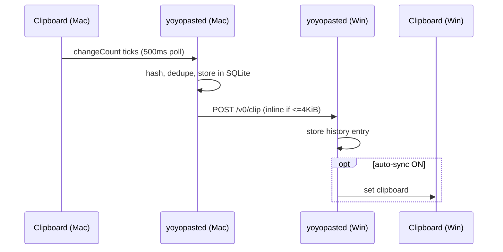
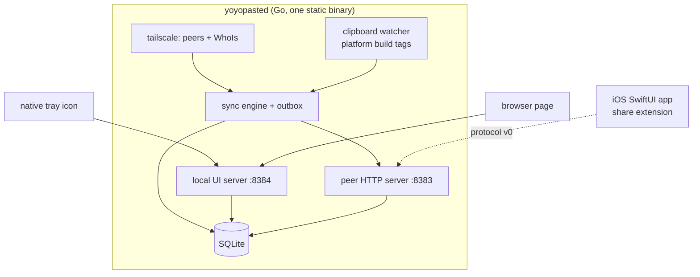

# YoYoPaste Architecture

> One daemon per device. They talk plain HTTP over the tailnet. That is the whole system.

## 1. Decisions

| # | Area | Decision | Rejected | Rationale |
|---|------|----------|----------|-----------|
| D1 | Transport | HTTP/1.1 + Server-Sent Events | gRPC, WebSocket, custom TCP | `net/http` covers send, receive, streaming and resume with zero dependencies. A mesh VPN removes every reason to hand-roll framing. |
| D2 | Serialization | JSON, with clipboard text carried inline | Protobuf, MessagePack, CBOR | A clipboard item is small. Codegen buys nothing for a few hundred bytes. |
| D3 | Encryption | WireGuard, provided by Tailscale. **No application crypto.** | TLS-in-tailnet, libsodium, custom AEAD | WireGuard gives E2E encryption and perfect forward secrecy between peers. An extra layer adds attack surface, key management and bugs while adding no security. |
| D4 | ~~File transfer~~ | **Withdrawn 2026-09-10 — out of scope.** YoYoPaste syncs clipboard text only. No blobs, no `Range`, no resume. | Chunked POST, WebRTC, raw TCP | The owner scoped the product to clipboard sync. Everything the blob path existed for — ranged reads, resume, sha256 verification of payloads, byte-based retention — goes with it. See YYP-068. |
| D5 | Clipboard watch | macOS/iOS: poll `NSPasteboard.changeCount` @ 500 ms. Windows: `AddClipboardFormatListener` (event-driven). | Uniform polling; uniform events | Not a preference. AppKit exposes no pasteboard change event; Win32 does. Use what each platform actually has. |
| D6 | Storage | SQLite (`modernc.org/sqlite`, pure Go) | Filesystem-only, in-memory + snapshot | History needs ordering, search and eviction — that is a table. Pure-Go driver keeps `GOOS=windows` cross-compilation a one-liner. |
| D7 | Discovery + AuthN | Tailscale LocalAPI: `Status()` to list peers, `WhoIs(remoteAddr)` to authenticate every inbound request | Tailscale control API + key, mDNS, subnet scan | Needs no API key, no config, no scanning. Identity is asserted by the tailnet itself; we compare the caller's node owner to ours and reject mismatches. |
| D8 | UI | Go daemon → native system tray + a page served on `127.0.0.1`. iOS is a separate native SwiftUI app. | Tauri, Electron, Flutter, gomobile-shared core | The entire UI is a toggle, a link and a 4-column table. That does not justify a bundled browser or a mobile FFI toolchain. The **protocol** is the cross-platform contract, not a shared binary. |
| D9 | Language | Go (desktop core), Swift (iOS) | Rust, C++, C# | Tailscale ships a first-party Go client library. Single static binary, trivial cross-compile, `net/http` is our transport. |
| D10 | Build | Go modules + `goreleaser`; Xcode for iOS | CMake, Bazel, npm | One `.goreleaser.yaml` produces signed macOS universal + Windows binaries and a changelog. |

| D11 | Participant discovery | On startup and on peer change, probe every same-user peer with `GET /v0/hello`; only responders are YoYoPaste devices | Broadcast to all tailnet peers | `tsnet.Peers` lists *every* device on the tailnet — routers, servers, phones without the app. Sending clipboard announcements to all of them means a failed HTTP call and an outbox row per non-participant, per copy. `/v0/hello` already exists for exactly this and was never called. |
| D12 | Mobile discovery | Mobile clients cannot read Tailscale's LocalAPI. They fetch the roster from a desktop peer via `GET /v0/peers`, bootstrapped once from one address | LocalAPI on mobile; mDNS; a coordination server | The Tailscale iOS/Android apps do not expose LocalAPI to other apps, so `tsnet.Peers` is desktop-only. A desktop already has the roster; serving it is one endpoint. Mobile needs exactly one address to start, shown as a QR code in the desktop UI. |
| D13 | Mobile clipboard posture | iOS and Android are **foreground and share-sheet only**. No background clipboard monitoring. | A background clipboard service | Android 10+ blocks background clipboard reads outright, and iOS offers no pasteboard change event in the background. This is a platform limit, not a design preference — auto-sync is a desktop-only capability and the UI must say so rather than appear broken. |

| D14 | Windows process identity | `yoyopasted` runs **in the session of the user who owns the Tailscale GUI**, never as a SYSTEM service | A Windows service; running as any admin | Verified on `vista` 2026-09-09: `tailscaled` runs as SYSTEM but `tailscale-ipn` runs as the logged-in user, and the LocalAPI authorizes only that user. A daemon started as any other account gets `401 Unauthorized: Tailscale already in use by <user>`, so `SelfIP` fails and the peer server never binds. This rules out the obvious "install as a Windows service" design. |

### Consequences
- **No central server, ever.** There is no code path that talks to a host we do not own.
- The daemon **refuses to listen on `0.0.0.0`**. It binds only the Tailscale IP (peers) and `127.0.0.1` (local UI). Off-tailnet traffic is unreachable, not merely rejected.
- If Tailscale is not running, YoYoPaste reports "Tailscale offline" and does nothing. No fallback transport.

## 2. Protocol v0

Peer listener: **Tailscale IP only**, TCP **8383**. Local UI listener: **`127.0.0.1:8384`** (never on the tailnet).

Every inbound peer request is authenticated by `WhoIs(RemoteAddr)`; a caller outside the tailnet or belonging to another user gets `403` and is logged once.

```
GET  /v0/hello                 -> 200 {"id","name","os","version"}   participation probe
GET  /v0/peers                 -> 200 [{id,name,os,ip,online,last_sync}]  roster, for mobile clients
POST /v0/clip                  -> 204   announce a clipboard item
GET  /v0/events                -> 200 text/event-stream  (announcements to this peer)
```

`POST /v0/clip` body:
```json
{
  "id":       "01J8Z...",            // ULID, globally unique, orders naturally
  "kind":     "text" | "file",
  "mime":     "text/plain; charset=utf-8",
  "size":     4823,                  // bytes
  "sha256":   "…",                   // integrity + dedupe
  "origin":   "<sender device id>",
  "created":  "2026-09-08T09:37:00Z",
  "inline":   "hello world"          // present only when kind=text and size <= 4 KiB
}
```

**Flow — text.** Sender POSTs `/v0/clip` with `inline` set, to each participating
peer in parallel. Receiver stores it and, if auto-sync is on, sets its local
clipboard. One round trip.

Text larger than 4 KiB is still sent inline; the cap exists to bound a single
request, not to trigger a second transfer mode. Anything above the body limit is
rejected rather than chunked.

**Offline queue.** Undelivered announcements stay in the `outbox` table with an attempt count. On a peer transitioning to online (observed via LocalAPI status), the sender drains its outbox for that peer, oldest first. Blobs are never queued — the receiver pulls when it is ready, so a queued announcement is ~200 bytes.

## 3. Data flow



## 4. Component map



## 5. UI concept

Exactly four things. The tray menu is the whole app for most sessions; the page exists for the table.

```
┌──────────────────────────────────────────────────────┐
│  YoYoPaste                        ●  ON  [   ▮]   ⌗  │   ⌗ = GitHub
├──────────────────────────────────────────────────────┤
│  DEVICE          TAILSCALE IP     STATUS   LAST SYNC │
│  yeyo-mbp        100.94.12.7      ● online   just now│
│  yeyo-pc         100.101.4.23     ● online   2m ago  │
│  yeyo-iphone     100.77.30.9      ○ offline  1h ago  │
└──────────────────────────────────────────────────────┘
```

No settings screen, no preferences window, no onboarding. Auto-sync is the only behavioural switch and it lives in the tray menu, not the page.

## 6. Performance

Measured 2026-09-09, Mac (`100.94.132.8`) → Windows `vista` (`100.69.105.61`), **DERP `waw` relay, no direct path** (symmetric NAT):

| Measurement | Value |
|---|---|
| `tailscale ping` RTT | 156–159 ms |
| TCP connect | ~160 ms (1 RTT) |
| `POST /v0/clip` total, cold connection | **316–330 ms** (2 RTT: handshake + request) |
| `GET /v0/hello` total | 320–350 ms |

`peer.Send` uses a package-level `http.Client`, so the daemon keeps connections
alive and steady-state sends cost roughly one RTT (~160 ms) rather than two.

**The <100 ms target does not hold over DERP.** It is a relay round trip, and no
amount of local optimisation changes that. The target is achievable only on a
direct WireGuard path, which this tailnet never established. Direct-path numbers
are still unmeasured — do not quote any until they are.

What is genuinely fast is the local half: the user's own clipboard is written
before any network call, so copying never blocks on a peer.

## 7. Security posture

- Encryption in transit: WireGuard (D3). Application adds nothing.
- Authentication: `WhoIs` on every peer request; same-tailnet-user only.
- At rest: on Unix the store directory is `0700` and the SQLite file is `0600` inside the OS per-user app-support dir; on Windows the per-user `%LOCALAPPDATA%\YoYoPaste` directory is ACL-restricted to the current user by the OS and `os.Chmod` is skipped (Windows `chmod` only toggles read-only). Full-disk encryption is the platform's job — a passphrase we store next to the data protects nothing.
- Zero telemetry. No analytics, no crash reporting, no update ping. The only outbound host is a tailnet peer.
- Permissions requested: clipboard access, and on macOS the Accessibility/pasteboard prompt. Nothing else.
