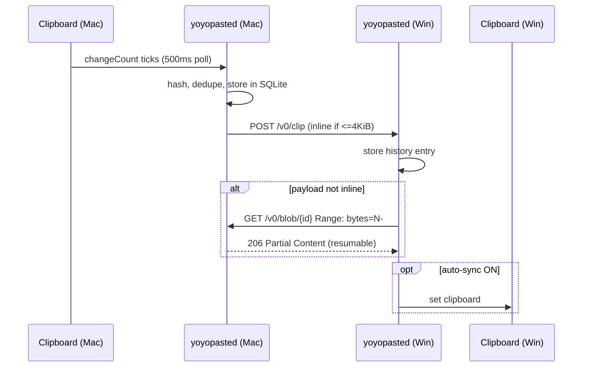
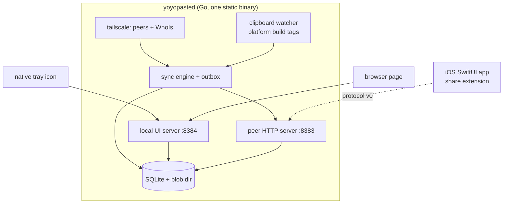

# YoYoPaste Architecture

> One daemon per device. They talk plain HTTP over the tailnet. That is the whole system.

## 1. Decisions

| # | Area | Decision | Rejected | Rationale |
|---|------|----------|----------|-----------|
| D1 | Transport | HTTP/1.1 + Server-Sent Events | gRPC, WebSocket, custom TCP | `net/http` covers send, receive, streaming and resume with zero dependencies. A mesh VPN removes every reason to hand-roll framing. |
| D2 | Serialization | JSON metadata; raw `Content-Type` bodies for payloads | Protobuf, MessagePack, CBOR | Metadata is ~200 bytes. Payloads must never be encoded into a JSON string — a 4 GB file would become a 5.4 GB base64 blob held in RAM. |
| D3 | Encryption | WireGuard, provided by Tailscale. **No application crypto.** | TLS-in-tailnet, libsodium, custom AEAD | WireGuard gives E2E encryption and perfect forward secrecy between peers. An extra layer adds attack surface, key management and bugs while adding no security. |
| D4 | File transfer | Sender announces; **receiver pulls** the blob with HTTP `Range` | Chunked POST, WebRTC data channels, raw TCP | `http.ServeContent` implements ranged reads. Resume is then free: the receiver re-requests from the last byte it stored. Pull also means the sender never buffers a file it might not need to send. |
| D5 | Clipboard watch | macOS/iOS: poll `NSPasteboard.changeCount` @ 500 ms. Windows: `AddClipboardFormatListener` (event-driven). | Uniform polling; uniform events | Not a preference. AppKit exposes no pasteboard change event; Win32 does. Use what each platform actually has. |
| D6 | Storage | SQLite (`modernc.org/sqlite`, pure Go) + blobs on disk | Filesystem-only, in-memory + snapshot | History needs ordering, search and eviction — that is a table. Pure-Go driver keeps `GOOS=windows` cross-compilation a one-liner. |
| D7 | Discovery + AuthN | Tailscale LocalAPI: `Status()` to list peers, `WhoIs(remoteAddr)` to authenticate every inbound request | Tailscale control API + key, mDNS, subnet scan | Needs no API key, no config, no scanning. Identity is asserted by the tailnet itself; we compare the caller's node owner to ours and reject mismatches. |
| D8 | UI | Go daemon → native system tray + a page served on `127.0.0.1`. iOS is a separate native SwiftUI app. | Tauri, Electron, Flutter, gomobile-shared core | The entire UI is a toggle, a link and a 4-column table. That does not justify a bundled browser or a mobile FFI toolchain. The **protocol** is the cross-platform contract, not a shared binary. |
| D9 | Language | Go (desktop core), Swift (iOS) | Rust, C++, C# | Tailscale ships a first-party Go client library. Single static binary, trivial cross-compile, `net/http` is our transport. |
| D10 | Build | Go modules + `goreleaser`; Xcode for iOS | CMake, Bazel, npm | One `.goreleaser.yaml` produces signed macOS universal + Windows binaries and a changelog. |

### Consequences
- **No central server, ever.** There is no code path that talks to a host we do not own.
- The daemon **refuses to listen on `0.0.0.0`**. It binds only the Tailscale IP (peers) and `127.0.0.1` (local UI). Off-tailnet traffic is unreachable, not merely rejected.
- If Tailscale is not running, YoYoPaste reports "Tailscale offline" and does nothing. No fallback transport.

## 2. Protocol v0

Peer listener: **Tailscale IP only**, TCP **8383**. Local UI listener: **`127.0.0.1:8384`** (never on the tailnet).

Every inbound peer request is authenticated by `WhoIs(RemoteAddr)`; a caller outside the tailnet or belonging to another user gets `403` and is logged once.

```
GET  /v0/hello                 -> 200 {"id","name","os","version"}
POST /v0/clip                  -> 204   announce a clipboard item
GET  /v0/events                -> 200 text/event-stream  (announcements to this peer)
GET  /v0/blob/{id}             -> 200/206 payload, honours Range:
HEAD /v0/blob/{id}             -> 200 Content-Length, Accept-Ranges: bytes
```

`POST /v0/clip` body:
```json
{
  "id":       "01J8Z...",            // ULID, globally unique, orders naturally
  "kind":     "text" | "file",
  "mime":     "text/plain; charset=utf-8",
  "name":     "notes.pdf",           // "" for text
  "size":     4823,                  // bytes
  "sha256":   "…",                   // integrity + dedupe
  "origin":   "<sender device id>",
  "created":  "2026-09-08T09:37:00Z",
  "inline":   "hello world"          // present only when kind=text and size <= 4 KiB
}
```

**Flow — text (the <100 ms path).** Sender POSTs `/v0/clip` with `inline` set to each online peer, in parallel. Receiver writes to history and, if auto-sync is on, sets its local clipboard. One round trip, no pull.

**Flow — file / large text.** Sender POSTs metadata with no `inline`. Receiver GETs `origin`'s `/v0/blob/{id}` with `Range: bytes=N-`, where `N` is the size already on disk. On any failure it retries the same request from the new `N`. Resume is a consequence of the design, not a feature to build.

**Offline queue.** Undelivered announcements stay in the `outbox` table with an attempt count. On a peer transitioning to online (observed via LocalAPI status), the sender drains its outbox for that peer, oldest first. Blobs are never queued — the receiver pulls when it is ready, so a queued announcement is ~200 bytes.

## 3. Data flow



## 4. Component map



## 5. UI concept

Exactly four things. The tray menu is the whole app for most sessions; the page exists for the table.

```
┌──────────────────────────────────────────────────────┐
│  YoYoPaste                        ●  ON  [   ▮]   ⌗  │   ⌗ = GitHub
├──────────────────────────────────────────────────────┤
│  DEVICE          TAILSCALE IP     STATUS   LAST SYNC │
│  yeyo-mbp        100.94.12.7      ● online   just now│
│  yeyo-pc         100.101.4.23     ● online   2m ago  │
│  yeyo-iphone     100.77.30.9      ○ offline  1h ago  │
└──────────────────────────────────────────────────────┘
```

No settings screen, no preferences window, no onboarding. Auto-sync is the only behavioural switch and it lives in the tray menu, not the page.

## 6. Security posture

- Encryption in transit: WireGuard (D3). Application adds nothing.
- Authentication: `WhoIs` on every peer request; same-tailnet-user only.
- At rest: blob directory and SQLite file are `0600`, inside the OS per-user app-support dir. Full-disk encryption is the platform's job — a passphrase we store next to the data protects nothing.
- Zero telemetry. No analytics, no crash reporting, no update ping. The only outbound host is a tailnet peer.
- Permissions requested: clipboard access, and on macOS the Accessibility/pasteboard prompt. Nothing else.
